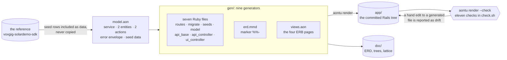

# rb-solar: a Rails application, generated


## Entities and relationships

The Rails app manages planets and their moons. It serves a JSON API and
HTML pages over the same SQLite database. The seed data contains eight
planets and twenty-one moons from the
[Solar System reference API](https://github.com/voxgig-sdk/voxgig-solardemo-sdk).

| Entity | Fields | Relationship |
|---|---|---|
| Planet | String `id`, `name`, `kind`, `diameter`, `terraform_state`, `forbid_state`, `forbid_reason` | Has zero or more moons |
| Moon | String `id`, `name`, `kind`, `diameter`, `planet_id` | Belongs to one planet |

Both entities use caller-supplied string IDs. Active Record validates the
required fields. A moon requires a planet, and deleting a planet destroys
its moons through the Active Record association.


The ERD uses database column names. JSON responses use `terraformState`,
`forbidState`, and `forbidReason` for the corresponding planet fields;
`planet_id` keeps the same name in the database and API.

Learn [how aontu generates this ERD](doc/erd.md), from the parent
relationship and field flags to the Mermaid output.

## The Rails application

The browser pages list planets, show a planet, list its moons, and show a
moon. These pages are read-only. The API provides create, read, update,
and delete operations for both entities, plus the planet actions
`forbid` and `terraform`.

| Interface | Routes | Response |
|---|---|---|
| Browser | `/`, `/planets`, `/planets/:planet_id` | Planet list or details |
| Browser | `/planets/:planet_id/moons`, `/planets/:planet_id/moons/:moon_id` | A planet's moon list or moon details |
| Planet API | `/api/planet`, `/api/planet/:planet_id` | JSON records |
| Moon API | `/api/planet/:planet_id/moon`, `/api/planet/:planet_id/moon/:moon_id` | JSON records scoped to a planet |
| Planet actions | `/api/planet/:planet_id/forbid`, `/api/planet/:planet_id/terraform` | JSON action result |

The API returns errors as `{error, message}` with status 400 for invalid
input, 404 for a missing record, and 409 for a duplicate ID. Browser
controllers return 404 when the requested record is absent.

<a id="the-architecture"></a>
<a id="what-runs"></a>

## Application architecture

Routes select either a browser controller or an API controller. Both use
the `Planet` and `Moon` Active Record models. Browser controllers pass
records to ERB views; API controllers serialise records as JSON.


The API controllers inherit error handling from `Api::BaseController`.
Browser controllers inherit from `ApplicationController` and use the
shared application layout. The app has no separate service or repository
layer: controllers call Active Record directly.

## Application layers

The layers describe the running Rails app. aontu is used to generate
source files before the app runs; it is not part of request handling.


The generated controllers and models contain this example's application
behaviour. Rails supplies routing, view rendering, validation, and database
access. Handwritten configuration sets up the runtime and shared UI layout.

<a id="what-is-hand-written"></a>

## Folder structure and file ownership

Paths below are relative to the example's `app/` directory. `[G]` marks
files generated by aontu; `[H]` marks files maintained by hand, including
Rails scaffold files. Directories can contain both kinds.

```tree
app/                                      Rails application root
├── Gemfile                               [H] dependencies
├── Rakefile                              [H] Rails tasks
├── config.ru                             [H] Rack entry point
├── bin/                                  [H] Rails and development commands
├── config/
│   ├── routes.rb                         [G] browser and API routes
│   ├── application.rb                    [H] application configuration
│   ├── database.yml                      [H] SQLite configuration
│   ├── puma.rb                           [H] web server configuration
│   ├── boot.rb, environment.rb           [H] Rails startup
│   ├── environments/                     [H] per-environment settings
│   ├── initializers/                     [H] assets, logging, inflections
│   └── locales/                          [H] translations
├── app/
│   ├── controllers/
│   │   ├── application_controller.rb     [H] browser controller base
│   │   ├── planets_controller.rb         [G] planet HTML pages
│   │   ├── moons_controller.rb           [G] moon HTML pages
│   │   └── api/
│   │       ├── base_controller.rb        [G] API error responses
│   │       ├── planets_controller.rb     [G] planet CRUD and actions
│   │       └── moons_controller.rb       [G] moon CRUD
│   ├── models/
│   │   ├── application_record.rb         [H] Active Record base
│   │   ├── planet.rb                     [G] fields and moon association
│   │   └── moon.rb                       [G] fields and planet association
│   ├── helpers/application_helper.rb     [H] shared view helper
│   └── views/
│       ├── layouts/application.html.erb  [H] shared page layout
│       ├── planets/index.html.erb        [G] planet list
│       ├── planets/show.html.erb         [G] planet details
│       ├── moons/index.html.erb          [G] moon list
│       └── moons/show.html.erb            [G] moon details
└── db/
    ├── migrate/*_create_planets.rb        [G] planet table
    ├── migrate/*_create_moons.rb          [G] moon table
    └── seeds.rb                          [G] reference planet and moon data
```

Generated files carry a banner naming `aontu render` and `model.aon`.
`aontu render --check` compares them with the generator output and reports
manual changes as drift. It does not manage the handwritten files.
Database contents, logs, and temporary runtime files are not generated
application source and are omitted from this tree.

The surrounding example directory contains the inputs and checks:

```tree
rb-solar/
├── app/          Rails app: mixed ownership, detailed above
├── model.aon     Handwritten service, entity, field, and action definitions
├── gen/          Nine handwritten generators
├── ref/          Pinned API reference, seed data, and validation clients
├── doc/          Generated ERD and model views; authored architecture diagrams
└── check.sh      Generation checks and live application checks
```

## Running it

```sh
cd app && bundle install     # once
cd .. && ./check.sh
```

`check.sh` skips the server checks with a note when Ruby or the bundle is
absent, so the generation checks can still run. It honours `$AONTU`, so the
Go port runs the same check, and `RB_SOLAR_PORT` when 8901 is taken.

To drive the app by hand:

```sh
cd app
bin/rails db:reset
bin/rails server -p 8901
```

Then <http://localhost:8901/> for the pages and
<http://localhost:8901/api/planet> for the API.


## What it is held to

`ref/` carries the reference verbatim at one commit and nothing there
is edited: see [`ref/README.md`](ref/README.md), which also records
the one place the OpenAPI description and the executable validation
disagree, and why the executable one wins.

`check.sh` runs eleven checks, including two against the reference API:

- **`ref/validate.ts`**, the reference repository's own script,
  unmodified. It sends HTTP requests to the Rails app. All
  twenty of its tests pass, cascade delete and error envelope included.
- **the reference's Ruby SDK**, driving the app through its real
  client, in [`ref/sdk_live.rb`](ref/sdk_live.rb): thirteen assertions
  against the running server. The check exits 1 if no server is available.


## The model

[`model.aon`](model.aon) is the whole input. It states the service,
two entities with their fields and URL shapes, the two planet actions,
the error envelope, and it **includes the reference's seed data as
data** rather than copying it, so the rows this app serves and the
rows the reference serves cannot drift apart.

Seven things in it are worth reading for the reasons behind them:

- **The named collections are maps, keyed by their own names.** The
  entities, an entity's fields, its actions and the error envelope are
  all maps: `$.entity.planet.field.diameter` addresses a field,
  `parent: "planet"` on the moon names a key that exists, and a new one
  anywhere is an insertion rather than a position. A list would have
  given each of them a number nobody chose, that a reader has to count
  to and that moves when something is inserted in front of it.
- **Declare any required order in the model.** A map is
  walked in sorted-key order, so the order that is on the page is
  stated rather than smuggled in: `sequence` lists the two entities in
  the order the migrations create them and the seeds insert them,
  because a moon keys into a planet, and an action's `rule` stays a
  list for the reason set out below. Five of the nine generators
  write one file per entity and never see an order at all.
- **Every field states its JSON name.** The wire says `terraformState`
  where the column says `terraform_state`, and `planet_id` either way.
  What a field is called in a target is a fact about the model, not a
  rule in a template; a generator that derived one from the other would
  be guessing, and would be wrong three times out of seven here.
- **Every field answers `pk` and `fk`, including with `false`.**
  Rule tables need an explicit boolean to select fields by these flags.
- **An index page's key column is asked for, not assumed.** A table's
  header row and its body row are two dispatches over the same fields,
  and the body writes the key's cell itself because that one is a link.
  While `field` was a list with `id` written first, one loop over the
  fields put the key column first in both rows by luck; a map sorts,
  and every planet's `diameter` came out under a header reading `id`.
  Both rows now name the key first, and `check.sh` reads the live page
  and asks what is under `name`.
- **An action's rules are listed lowest priority first.** The generated
  form is a sequence of assignments and the last one wins, so this
  reproduces the reference's `if`/`elsif`: `{start: true, stop: true}`
  is terraforming, not idle: a case the reference's own validation
  never exercises.
- **Everything a generated line needs is on the node its rule matched.**
  An entity's indexes and seed rows are stated under the entity, each
  row carrying its own table or class, because a nested dispatch cannot
  see the node the enclosing one matched.


Follow the [model guide](doc/model.md) to inspect these values
and see how generators select them.

## The generators

Nine of them, in [`gen/`](gen/). Eight are **files in the language
they generate**: a marked line carries the aontu and the target's own
tools read the rest, so `ruby -c` parses the seven Ruby ones and a
Mermaid renderer draws the diagram:

| generator | writes |
|---|---|
| `routes.rb` | `config/routes.rb`, the UI and API routes |
| `migrate.rb` | one migration per entity, columns in model order |
| `seeds.rb` | the reference's eight planets and twenty-one moons |
| `model.rb` | the Active Record classes, associations, cascade, validations |
| `api_base.rb` | the `{error, message}` envelope, one method per error |
| `api_controller.rb` | the five verbs, the actions, the serialiser, the parent scope |
| `ui_controller.rb` | the page controllers |
| `erd.mmd` | the ER diagram: a Mermaid file whose marker is `%%-` |
| `views.aon` | the four ERB pages, in canonical aontu |

`views.aon` is the exception, and the reason is a limit worth knowing:
ERB's only comment is `<%# … %>`, a delimited form closing `%>`, and
the template surface's block marker is fixed to the C family (`/*-` …
`*/`). No marker an ERB file can carry is one ERB itself ignores, so a
generator written as an `.html.erb` file could not stay valid in its
own language, which is the whole promise.

`erd.mmd` shows the other side of that: Mermaid is not in the marker
table, and one `--marker '%%-'` is all it costs.

All nine are in the form `aontu fmt` writes, and `check.sh` says so.
A generator is two documents on one page (the target's, in its own
lines, and aontu's, in the marker lines) and only the first one used to
have a shape you could read. The marker now stands at the left margin
with the aontu indented after it, so the tree is visible as a tree:

```rb
#- aontu: Code: units: [
#-   {
#-     path: "config/routes.rb"
#-     decls: [
#-       { k: "frag", of: [
# Generated by `aontu render` from model.aon. Do not edit.
```

Nothing in this moves a line of the generated app: `render --check`
compares byte for byte, and the first check in `check.sh` is that one.


The [Rails template guide](doc/rails-code.md) follows a service
value into a route and required fields into Active Record validations.

## How the app is generated

One model, nine generators, one tree. `render --check` compares what
the generators would write against what is committed, so the arrow back
is a gate rather than a suggestion.




## Changing the application

Choose where to make a change according to who owns the file. Generated
files come from the model and generators. Handwritten files are maintained
as ordinary Rails code.

Follow [change and check the generated app](doc/change-and-check.md)
to add a field, regenerate the outputs, and check the resulting diff.

### Where to edit

| you are changing | edit | what holds it |
|---|---|---|
| a **fact about the system**: a field, an entity, a route shape, an action's rules, a seed row | `model.aon` | the model is the only statement of it; every target follows |
| **how a fact becomes code**: the shape of a controller, the columns a migration writes | the generator in `gen/` | it stays a valid file in its own language, so `ruby -c` still parses it |
| **anything the model does not decide**: a Gemfile, an initialiser, a background job, a service object, a bespoke query | the hand-written set | nothing; it is ordinary Ruby, reviewed like ordinary Ruby |

The boundary is not a convention anyone has to remember. Every
generated file opens with

```ruby
# Generated by `aontu render` from model.aon. Do not edit.
```

and `render --check` compares the whole tree against what the
generators would write. A hand edit to a generated file is drift, and
the check names the file.

### Extending generated code

The interesting case is not the one the rules cover. It is the day
someone needs a generated file to do something the model has no way to
say. Choose how to extend the generated application:

1. **Lift it into the model.** The change is a fact about the system,
   so state it once and let every target that cares consume it. This is
   right when the same fact would otherwise be repeated by hand in the
   API controller, the UI controller and the ERD.
2. **Teach the generator.** The change is about how a fact becomes
   code, not about the system. The model does not move; one rule does.
3. **Move the file out.** Delete its rule, drop the banner, and it
   becomes an ordinary hand-written file. This is a real option and
   sometimes the right one: a controller that has grown genuinely
   bespoke logic is no longer a consequence of the model, and
   pretending otherwise makes the generator worse for everything else.

What is **not** an answer is editing the generated file and leaving it.
That is the state the check exists to make visible in the next check.

### Checking agent changes

An agent can edit a generated file without updating its model or
generator. Run the checks to detect that mismatch:

- **Changed generated files are identified.** `render --check` answers
  "did anything I touched belong to the model" in one command, over the
  whole tree. No reviewer has to hold the generated
  set in their head.
- **The fix is mechanical.** Drift on a generated file means one of the
  three answers above, and the diff shows which: a hand edit that the
  generator would also have written is a model change waiting to be
  named; one it would not is a bespoke change that has to move out.
- **The API behaviour is tested.** The eleven checks end with
  other people's code: the reference's twenty validation tests and its
  own SDK, driving the running app. A change can satisfy every
  structural check and still be wrong, and those legs are what say so.

The generated half and the hand-written half are reviewed differently
on purpose. A diff to `app/` under a generated banner should be read as
a diff to `model.aon` or to `gen/`, because that is what caused it, and
the check will not let it be anything else.


## Diagram sources

The [ERD](doc/erd.mmd) is generated from the same entity definitions as
the Rails models. The model tree, planet tree, and value lattice are
produced by `aontu view` and checked against committed text and SVG files.
The [application architecture](doc/architecture.mmd) and
[layer diagram](doc/layers.mmd) describe the committed Rails source.

## Learn to use aontu with this example

- [Read the application model](doc/model.md). Set up the CLI and inspect fields, associations, ordering, and seed data.
- [Generate Rails code](doc/rails-code.md). Follow template markers, selections, replacements, and output paths.
- [Generate the ERD](doc/erd.md). Trace entity relationships and field flags into Mermaid source and the displayed diagram.
- [Change and check the app](doc/change-and-check.md). Add an optional field, regenerate the targets, and verify the application.
