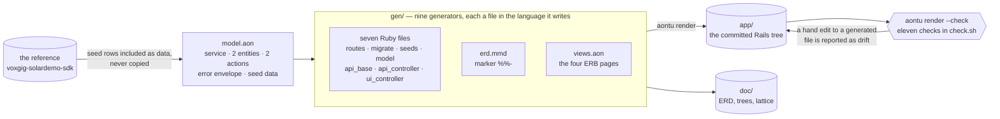
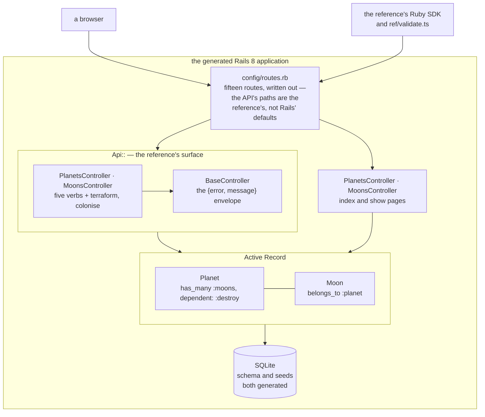

# rb-solar — a Rails application, generated


A Ruby on Rails 8 implementation of the
[voxgig-solardemo-sdk](https://github.com/voxgig-sdk/voxgig-solardemo-sdk)
Solar System API, and a human UI over the same data, **generated from
one model** by `aontu render` and held to the reference's own
validation.

The point is not that a generator can write Rails. It is that the
model is the only thing anyone edits: the routes, the migrations, the
Active Record classes, both sets of controllers, the pages, the seeds
and the entity-relationship diagram are all consequences of it, and
`aontu render --check` says so on every run.

## What it is held to

`ref/` carries the reference verbatim at one commit and nothing there
is edited — see [`ref/README.md`](ref/README.md), which also records
the one place the OpenAPI description and the executable validation
disagree, and why the executable one wins.

`check.sh` runs eleven checks. The two that matter most are other
people's code:

- **`ref/validate.ts`**, the reference repository's own script,
  unmodified. It takes a base URL and speaks HTTP, so it does not know
  or care that the thing answering is Rails rather than Fastify. All
  twenty of its tests pass, cascade delete and error envelope included.
- **the reference's Ruby SDK**, driving the app through its real
  client, in [`ref/sdk_live.rb`](ref/sdk_live.rb) — thirteen assertions
  that fail, and that exit 1 with no server. Not the SDK's own suite,
  which passes with the server turned off ([#177](https://github.com/aontu-lang/aontu/issues/177)).

## The model

[`model.aon`](model.aon) is the whole input. It states the service,
two entities with their fields and URL shapes, the two planet actions,
the error envelope, and it **includes the reference's seed data as
data** rather than copying it, so the rows this app serves and the
rows the reference serves cannot drift apart.

Five things in it are worth reading for the reasons behind them:

- **The entities are a map, keyed by their own names.** `$.entity.planet`
  addresses one, `parent: "planet"` on the moon names a key that exists,
  and a third entity is an insertion rather than a position. A map is
  walked in sorted-key order, so where the order is on the page the
  model states it: `sequence` lists the two in the order the migrations
  create them and the seeds insert them, because a moon keys into a
  planet. Five of the nine generators write one file per entity and
  never see an order at all.
- **Every field states its JSON name.** The wire says `terraformState`
  where the column says `terraform_state`, and `planet_id` either way.
  What a field is called in a target is a fact about the model, not a
  rule in a template; a generator that derived one from the other would
  be guessing, and would be wrong three times out of seven here.
- **Every field answers `pk` and `fk`, including with `false`.**
  Absence is not an answer a rule table can read
  ([BUGS.md §88](../../../use-cases/BUGS.md)).
- **An action's rules are listed lowest priority first.** The generated
  form is a sequence of assignments and the last one wins, so this
  reproduces the reference's `if`/`elsif`: `{start: true, stop: true}`
  is terraforming, not idle — a case the reference's own validation
  never exercises.
- **Everything a generated line needs is on the node its rule matched.**
  An entity's indexes and seed rows are stated under the entity, each
  row carrying its own table or class, because a nested dispatch cannot
  see the node the enclosing one matched.

## The generators

Nine of them, in [`gen/`](gen/). Eight are **files in the language
they generate** — a marked line carries the aontu and the target's own
tools read the rest, so `ruby -c` parses the seven Ruby ones and a
Mermaid renderer draws the diagram:

| generator | writes |
|---|---|
| `routes.rb` | `config/routes.rb`, fifteen routes |
| `migrate.rb` | one migration per entity, columns in model order |
| `seeds.rb` | the reference's eight planets and twenty-one moons |
| `model.rb` | the Active Record classes, associations, cascade, validations |
| `api_base.rb` | the `{error, message}` envelope, one method per error |
| `api_controller.rb` | the five verbs, the actions, the serialiser, the parent scope |
| `ui_controller.rb` | the page controllers |
| `erd.mmd` | the ER diagram — a Mermaid file whose marker is `%%-` |
| `views.aon` | the four ERB pages, in canonical aontu |

`views.aon` is the exception, and the reason is a limit worth knowing:
ERB's only comment is `<%# … %>`, a delimited form closing `%>`, and
the template surface's block marker is fixed to the C family (`/*-` …
`*/`). No marker an ERB file can carry is one ERB itself ignores, so a
generator written as an `.html.erb` file could not stay valid in its
own language — which is the whole promise.

`erd.mmd` shows the other side of that: Mermaid is not in the marker
table, and one `--marker '%%-'` is all it costs.

All nine are in the form `aontu fmt` writes, and `check.sh` says so.
A generator is two documents on one page — the target's, in its own
lines, and aontu's, in the marker lines — and only the first one used to
have a shape you could read. The marker now stands at the left margin
with the aontu indented after it, so the tree is visible as a tree:

```rb
#- code: units: [
#-   {
#-     path: "config/routes.rb"
#-     decls: [
#-       { k: "frag", of: [
# Generated by `aontu render` from model.aon. Do not edit.
```

Nothing in this moves a line of the generated app: `render --check`
compares byte for byte, and the first check in `check.sh` is that one.

## The architecture

Two pictures: where the code comes from, and what it does once it runs.

### Where the code comes from

One model, nine generators, one tree. `render --check` compares what
the generators would write against what is committed, so the arrow back
is a gate rather than a suggestion.



### What runs

The generated Rails app serves two faces over one set of records: the
reference's API, path for path, and a human UI. Both reach the same
Active Record classes, so neither can drift from the other.



Everything in both diagrams except the hand-written set below is a
consequence of `model.aon`.

## What is hand-written

Only what the model does not decide: `Gemfile`, `config/`, `bin/`,
`ApplicationController`, `ApplicationRecord`, `ApplicationHelper` and
the layout. Nothing hand-written carries the generated banner, and
nothing generated is edited — `render --check` reports a hand edit as
drift.

## How development actually works

A generated scaffold that may only ever be regenerated is a demo. A
real system is edited for years, by people and increasingly by agents,
and most of that editing is not something a model should decide. So the
question this system exists to answer is not "can a generator write
Rails" — it is **where does hand work go, and what stops it drifting.**

### Three places work happens, and they are not interchangeable

| you are changing | edit | what holds it |
|---|---|---|
| a **fact about the system** — a field, an entity, a route shape, an action's rules, a seed row | `model.aon` | the model is the only statement of it; every target follows |
| **how a fact becomes code** — the shape of a controller, the columns a migration writes | the generator in `gen/` | it stays a valid file in its own language, so `ruby -c` still parses it |
| **anything the model does not decide** — a Gemfile, an initializer, a background job, a service object, a bespoke query | the hand-written set | nothing; it is ordinary Ruby, reviewed like ordinary Ruby |

The boundary is not a convention anyone has to remember. Every
generated file opens with

```ruby
# Generated by `aontu render` from model.aon. Do not edit.
```

and `render --check` compares the whole tree against what the
generators would write. A hand edit to a generated file is drift, and
the check names the file.

### Working against the grain, on purpose

The interesting case is not the one the rules cover. It is the day
someone needs a generated file to do something the model has no way to
say. There are three honest answers, and choosing between them is the
design work:

1. **Lift it into the model.** The change is a fact about the system,
   so state it once and let every target that cares consume it. This is
   right when the same fact would otherwise be repeated by hand in the
   API controller, the UI controller and the ERD.
2. **Teach the generator.** The change is about how a fact becomes
   code, not about the system. The model does not move; one rule does.
3. **Move the file out.** Delete its rule, drop the banner, and it
   becomes an ordinary hand-written file. This is a real option and
   sometimes the right one — a controller that has grown genuinely
   bespoke logic is no longer a consequence of the model, and
   pretending otherwise makes the generator worse for everything else.

What is **not** an answer is editing the generated file and leaving it.
That is the state the check exists to make impossible to reach quietly.

### Why this is the shape an agent needs

An agent asked to add a feature will edit whatever file is nearest the
symptom. That is the failure mode; it is also unavoidable. The gate is
what makes it recoverable:

- **The blast radius is stated, not guessed.** `render --check` answers
  "did anything I touched belong to the model" in one command, over the
  whole tree, in under a second. No reviewer has to hold the generated
  set in their head.
- **The fix is mechanical.** Drift on a generated file means one of the
  three answers above, and the diff shows which — a hand edit that the
  generator would also have written is a model change waiting to be
  named; one it would not is a bespoke change that has to move out.
- **The reference is still the judge.** The eleven checks end with
  other people's code: the reference's twenty validation tests and its
  own SDK, driving the running app. A change can satisfy every
  structural check and still be wrong, and those legs are what say so.

The generated half and the hand-written half are reviewed differently
on purpose. A diff to `app/` under a generated banner should be read as
a diff to `model.aon` or to `gen/` — because that is what caused it, and
the check will not let it be anything else.

## Running it

```sh
cd app && bundle install     # once
cd .. && ./check.sh
```

`check.sh` skips the boot legs with a note when Ruby or the bundle is
absent, so the render half runs anywhere. It honours `$AONTU`, so the
Go port runs the same check, and `RB_SOLAR_PORT` when 8901 is taken.

To drive the app by hand:

```sh
cd app
bin/rails db:reset
bin/rails server -p 8901
```

Then <http://localhost:8901/> for the pages and
<http://localhost:8901/api/planet> for the API.

## The diagrams

All four are drawn from `model.aon` and pinned, so a model change that
alters the shape is a diff rather than a stale picture:
[`doc/erd.mmd`](doc/erd.mmd) by `render`, and the model tree, the
planet entity's tree and the value lattice by `aontu view`, each as
text and SVG.
