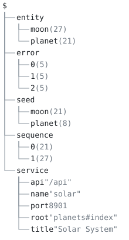

# rb-solar — a Rails application, generated



A Ruby on Rails 8 implementation of the
[voxgig-solardemo-sdk](https://github.com/voxgig-sdk/voxgig-solardemo-sdk)
Solar System API, and a human UI over the same data, **generated from
one model** by `aontu render` and held to the reference's own
validation.

The point is not that a generator can write Rails. It is that the
model is the only thing anyone edits: the routes, the migrations, the
Active Record classes, both sets of controllers, the pages, the seeds
and the entity-relationship diagram are all consequences of it, and
`aontu render --check` says so on every run.

## What it is held to

`ref/` carries the reference verbatim at one commit and nothing there
is edited — see [`ref/README.md`](ref/README.md), which also records
the one place the OpenAPI description and the executable validation
disagree, and why the executable one wins.

`check.sh` runs ten checks. The two that matter most are other
people's code:

- **`ref/validate.ts`**, the reference repository's own script,
  unmodified. It takes a base URL and speaks HTTP, so it does not know
  or care that the thing answering is Rails rather than Fastify. All
  twenty of its tests pass, cascade delete and error envelope included.
- **the reference's Ruby SDK**, driving the app through its real
  client. Not the SDK's own suite — see [below](#the-sdks-own-suite-is-not-a-check).

## The model

[`model.aon`](model.aon) is the whole input. It states the service,
two entities with their fields and URL shapes, the two planet actions,
the error envelope, and it **includes the reference's seed data as
data** rather than copying it, so the rows this app serves and the
rows the reference serves cannot drift apart.

Four things in it are worth reading for the reasons behind them:

- **Every field states its JSON name.** The wire says `terraformState`
  where the column says `terraform_state`, and `planet_id` either way.
  What a field is called in a target is a fact about the model, not a
  rule in a template; a generator that derived one from the other would
  be guessing, and would be wrong three times out of seven here.
- **Every field answers `pk` and `fk`, including with `false`.**
  Absence is not an answer a rule table can read
  ([BUGS.md §88](../../use-cases/BUGS.md)).
- **An action's rules are listed lowest priority first.** The generated
  form is a sequence of assignments and the last one wins, so this
  reproduces the reference's `if`/`elsif`: `{start: true, stop: true}`
  is terraforming, not idle — a case the reference's own validation
  never exercises.
- **Everything a generated line needs is on the node its rule matched.**
  An entity's indexes and seed rows are stated under the entity, each
  row carrying its own table or class, because a nested dispatch cannot
  see the node the enclosing one matched.

## The generators

Eight of them, in [`gen/`](gen/). Seven are **files in the language
they generate** — `#-` marks the aontu, and `ruby -c` parses the
generator itself:

| generator | writes |
|---|---|
| `routes.rb` | `config/routes.rb`, fifteen routes |
| `migrate.rb` | one migration per entity, columns in model order |
| `seeds.rb` | the reference's eight planets and twenty-one moons |
| `model.rb` | the Active Record classes, associations, cascade, validations |
| `api_base.rb` | the `{error, message}` envelope, one method per error |
| `api_controller.rb` | the five verbs, the actions, the serialiser, the parent scope |
| `ui_controller.rb` | the page controllers |
| `erd.mmd` | the ER diagram — a Mermaid file whose marker is `%%-` |
| `views.aon` | the four ERB pages, in canonical aontu |

`views.aon` is the exception, and the reason is a limit worth knowing:
ERB's only comment is `<%# … %>`, a delimited form closing `%>`, and
the template surface's block marker is fixed to the C family (`/*-` …
`*/`). No marker an ERB file can carry is one ERB itself ignores, so a
generator written as an `.html.erb` file could not stay valid in its
own language — which is the whole promise.

`erd.mmd` shows the other side of that: Mermaid is not in the marker
table, and one `--marker '%%-'` is all it costs.

## What is hand-written

Only what the model does not decide: `Gemfile`, `config/`, `bin/`,
`ApplicationController`, `ApplicationRecord`, `ApplicationHelper` and
the layout. Nothing hand-written carries the generated banner, and
nothing generated is edited — `render --check` reports a hand edit as
drift.

## Running it

```sh
cd app && bundle install     # once
cd .. && ./check.sh
```

`check.sh` skips the boot legs with a note when Ruby or the bundle is
absent, so the render half runs anywhere. It honours `$AONTU`, so the
Go port runs the same check, and `RB_SOLAR_PORT` when 8901 is taken.

To drive the app by hand:

```sh
cd app
bin/rails db:reset
bin/rails server -p 8901
```

Then <http://localhost:8901/> for the pages and
<http://localhost:8901/api/planet> for the API.

## What the exercise found

Writing this turned up four things in the engine and one in the plan.
All five are recorded where they belong; they are listed here because
finding them is what a system like this is for.

- **[BUGS.md §88](../../use-cases/BUGS.md)** — an `emit` rule's `match`
  admits a node the key is absent from, where `filter` refuses it. It
  bit twice, a day apart: once as a migration with no columns in it,
  once as an ER diagram marking every column a foreign key. Neither
  reported anything.
- **[BUGS.md §89](../../use-cases/BUGS.md)** — a relative reference
  resolves in a body element but not inside a call's argument there,
  and the miss is silent. The symptom was a migration missing its
  `add_index`, which rendered and would have been committed clean.
- **A placeholder inherits the target's lexical rules.** `def
  METHOD(ARGS)` is a Ruby syntax error — a constant cannot be a formal
  argument — so the generator stopped being a valid Ruby file. Where a
  placeholder stands where the target requires a local, it has to look
  like one.
- **`replace` reaches the lines a rule wrote**, and no further: a unit
  map's `decls[].of` is two levels below the rule's body, so a first
  attempt at the views put the page text there and every key came back
  `replace_unused` — correctly, since not one would have been
  substituted.
- **`--coverage` measures one document's reads.** This model is read by
  nine generators, and `$.error` is dead to the controller one and
  alive to the base one, so per-generator coverage says nothing here.
  `check.sh` collects every generator's dead set and fails on a path
  dead in all of them.

### The SDK's own suite is not a check

The plan called for the Ruby SDK's live tests. They were run, and they
are not a validation of anything: **246 cases pass with the server
turned off** — 71 skips against a live app, 72 against nothing, and two
HTTP requests in a whole run. Its live mode is lenient by design
("synthetic IDs frequently 4xx … skip rather than fail") and its unit
cases speak to a mock transport.

[`ref/sdk_live.rb`](ref/sdk_live.rb) is the leg instead: the same
client, against the real app, with thirteen assertions that fail. It
exits 1 with no server, which is the property the suite lacked. Set
`RB_SOLAR_SDK` to a checkout of the reference repository's `rb/`
directory; `check.sh` skips it with a note otherwise.

## In CI

[`ci-job.yml`](ci-job.yml) is the job, **waiting to be applied by a
maintainer**: the session that wrote this system cannot push workflow
files (GitHub refuses an OAuth app without the `workflow` scope), so
the job sits here instead of in `.github/workflows/build.yml`. Paste
its one block into that file's `jobs:` map and delete it.

It needs Ruby and Node, and it clones the reference repository for the
SDK leg — the SDK is not vendored here, because a copy of someone
else's client library in this tree would rot. Without that clone the
SDK check skips and the other nine still run.

## The diagrams

All four are drawn from `model.aon` and pinned, so a model change that
alters the shape is a diff rather than a stale picture:
[`doc/erd.mmd`](doc/erd.mmd) by `render`, and the model tree, the
planet entity's tree and the value lattice by `aontu view`, each as
text and SVG.
