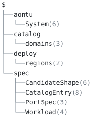
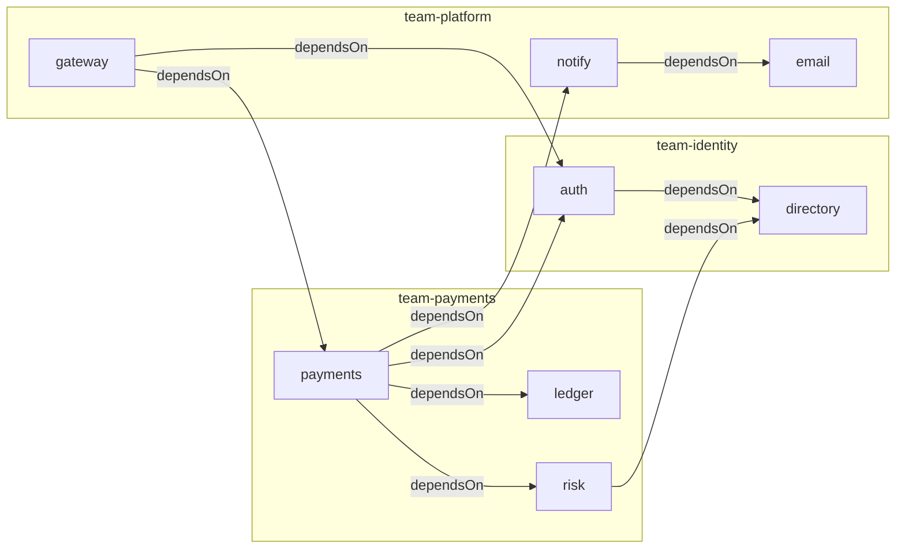

# 01. A company-wide service catalog as system ontology



## Scenario

A Backstage-style service catalog for "Acme": eight services across
three teams/domains (payments, identity, platform), each with owner,
tier, lifecycle, ports, protocols and `dependsOn` relations. Two
organisational units describe the **same services from different
angles**:

- `catalog.aon`: the catalog view: what each service *is* (owner,
  tier, description, dependencies), organised by domain.
- `deploy.aon`: the deployment view: what each cluster *runs*
  (image, replicas, ports), organised by region and cluster.

The deployment view REFERENCES its catalog entry's org facts, so one
evaluation of `system.aon` brings the two into contact and a drift
between them fails at the deploy position. This is the core enterprise
problem: the org chart and the runtime both hold facts about one
logical thing, and any drift between them should be an *error*, not a
silent fork. It is also the ground-truth-ontology problem for AI
agents: an agent must be able to pull one service's complete truth
into context (`aontu get`), ask where a fact came from (`aontu why`),
and have its own emitted candidates checked (`aontu vet`, `rel()`).

## The model tree

`system.aon` is one evaluation joining four things: the bundled
vocabulary (`std`), Acme's own (`spec`), the catalog view, and the
deployment view. `catalog` and `deploy` hold the same services seen from
different angles (what each one IS, and where each one RUNS) and
everything below them is domains or regions, then services, then fields.

```
$
├── %CatalogAddr re("^\\$[.]catalog[.]")
├── %Description string&length(integer&min(10))
├── %Lifecycle *"production"|"production"|"e...
├── %Owner re("^team-[a-z]+$")
├── catalog
│   └── domains (3)
├── deploy
│   └── regions (2)
├── spec
│   ├── CandidateShape (6)
│   ├── CatalogEntry (8)
│   ├── PortSpec (3)
│   └── Workload (4)
└── std
    ├── Component (1)
    ├── Port (2)
    └── Service (2)
```

`aontu view doc --depth 2 system.aon` draws it, and `check.sh` pins it
with `--out --check`. A key with `(n)` after it is a container the
depth bound stopped at, and `n` is how many keys are not drawn; a
leaf carries its canon, which is the kind of thing it is rather
than its value.

## Model design

| File | Role | Features exercised |
|---|---|---|
| `system.aon` | root: one evaluation joining the vocabulary and both views | `@"std/system"`, `@"./..."` includes, `hide()` |
| `spec.aon` | Acme vocabulary over the bundled one | `$.std.Service`, `$.std.Port`, conjunction-as-subclassing, `re`/`min`/`max`/`length` atoms, `*` defaults, optional `?` keys, `rel(t)` with `re()` address constraints, `acyclic()`, `inverse()` |
| `catalog.aon` | catalog view | per-domain `&:` spreads stamping owner + schema, `path()` address lists |
| `deploy.aon` | deployment view | references into the catalog view, defaults (`replicas: *2`) |
| `queries/queries.aon` | instance-of queries | `filter`, map union as index |
| `bad/*.aon` | change requests that must be refused | cycle, missing inverse, cross-view contradiction, wrong-kind endpoint, wrong-kind `rel()` target |
| `proposals/*.aon` + `data/*` | agent-emitted candidates | JSON-as-aontu, `vet --at --closed`, `rel()` existence checks |

Relations are declared on the field that holds them. In `spec.aon`:

```aon
%CatalogAddr = re("^\\$[.]catalog[.]")

dependsOn?: rel($.std.Service) & %CatalogAddr & acyclic() & inverse(dependedOnBy)
dependedOnBy?: rel($.std.Service) & %CatalogAddr
```

`%CatalogAddr` is an **alias**: `%name = value` at the top level of the
document declares one, `%name` in value position uses it, and that is
all it is. An alias does not generate and does not appear in canon, so
`spec.aon` with the names and `spec.aon` with the pattern written out at
both use sites are the same document and produce the same `aon1-`
hash: the change is readability, and the engine cannot tell. What it buys
is that a relation and its inverse can no longer be given different
address shapes by a typo. `%Owner`, `%Lifecycle` and `%Description` do
the same for the three fields `CatalogEntry` and `CandidateShape` both
promise, which have to be spelled twice because the vet anchor is
deliberately written out self-contained (gap 2), and an alias is *not* a
path (`$.%Owner` is refused at any depth), so naming them does not
reintroduce the reference that gap is about.

The key is the predicate. `rel($.std.Service)` types every far end,
and the type flows into each target instead of being repeated at every
link site; the held `re()` constrains every address, so a service may
depend on a catalog entry and never on a workload; `acyclic()` and
`inverse(dependedOnBy)` declare the graph properties the engine
checks. Data documents stay plain lists of `path(...)` values. The
inverse is written on every target, and `aontu relations` checks that
every edge is mirrored.

The two views meet at the deploy positions. Each workload in
`deploy.aon` references the `owner` and `tier` of its catalog entry,
so a contradiction between the views is a located error. The reference
is directional (the catalog is not changed by what a cluster runs),
which is what lets this file be one of several deployment views over
one catalog. Both views name the same `$.std.Service` and
`$.spec.PortSpec` templates, so a port has one shape wherever it
appears.

Spreads carry the schema. One line per domain
(`&: $.spec.CatalogEntry & {owner: "team-payments"}`) applies the
whole vocabulary and stamps ownership, and the `*` defaults fill in
`replicas: 2`, `direction: "in"` and `lifecycle: "production"`
wherever a file does not override them.

Change requests are overlays. Every `bad/*.aon` and `proposals/*.aon`
is `@"../system.aon"` plus the proposed delta, so verifying a change
before editing the base model costs one file and one CLI call. Lists
unify positionally, so a proposal that adds an inverse entry restates
the target's `dependedOnBy` list in full and in order
(`proposals/onboard-webhooks.aon`).

Agent-emitted JSON is already aontu. `data/candidate-webhooks.json` is
used twice unmodified: vetted against `$.spec.CandidateShape`, the
candidate's shape written out self-contained, and loaded at a hidden
key in `proposals/onboard-webhooks.aon` and pulled into the catalog by
reference (`$.spec.CatalogEntry & $.candidate`), where the full
`CatalogEntry` schema and the `rel()` checks apply.

Instance-of queries run over a flat index. `queries/queries.aon`
unifies `filter(services, {})` for each domain: an empty condition
keeps every entry, already stamped by its domain's spread, and leaves
the spread's template behind, so the three maps unify into one index
that `filter(.index, {tier: 1})` answers over.

## The catalog, drawn

Drawn from this model by
[`aontu view`](../../docs/reference-api.md#aontu-view) and pinned as
goldens by `check.sh`. The graph groups the services by their generated
`owner`, `aontu view graph --relation dependsOn --group-by owner`:



The same graph as a **dependency-structure matrix** in partition order
with the closure marked, `aontu view matrix --relation dependsOn
--order partition --closure`. A mark at (row, column) means the row
service depends on the column service: `X` directly, `+` through
others. The SVG is the same figure under `--as svg`, the same cells on
an integer grid, pinned as `expected/diagram-matrix.svg`:


```
            1 2 3 4 5 6 7 8
directory 1 \ . . . . . . .
email     2 . \ . . . . . .
ledger    3 . . \ . . . . .
auth      4 X . . \ . . . .
notify    5 . X . . \ . . .
risk      6 X . . . . \ . .
payments  7 + + X X X X \ .
gateway   8 + + + X + + X \
# above-diagonal direct cells: 0
```

The partition order is a perfect lower triangle, and **that is the
acyclicity proof**: `above-diagonal direct cells: 0` is not an
annotation on the picture, it is the picture's shape. The order is a
layering nobody wrote down (leaves (`directory`, `email`, `ledger`),
then `auth`/`notify`/`risk`, then `payments`, then `gateway`) and
rows 7 and 8 are the coupling: `gateway` reaches everything through
two hops.

The matrix is the form the empirical literature prefers past about
twenty vertices: Ghoniem, Fekete and Castagliola (InfoVis 2004) found
matrices beat node-link for most tasks at that size, with path-finding
the exception; Sangal et al. (OOPSLA 2005) is the software-dependency
application. At eight services both are readable, which is the point of
showing them together: the node-link picture reads as a shape, the
matrix reads as a table, and only the matrix stays legible as the
catalog grows.

## What check.sh proves

`check.sh` runs 21 checks through the real CLI: golden diffs for the
merged model, `get` slices and query results; grep-by-error-code
(never byte-compared error text) for the refusals; `relations`,
`reaches` and `vet` verdicts on good, bad and post-proposal models.

1. `system.aon` evaluates to `expected/system.json`: two views of
   eight entities, joined through the deployment view's references,
   against the bundled `std/system` vocabulary.
2. `--canon` renders `acyclic()` and `inverse("dependedOnBy")` back at
   their fields, so the canonical form distinguishes documents that
   disagree about their relations.
3. `aontu relations system.aon` answers `verdict: pass`: `dependsOn`
   is acyclic and every edge has its `dependedOnBy` mirror.
4. `aontu get '$.deploy.regions.eu1.clusters.core.workloads.payments'`
   matches `expected/payments-slice.json`. The workload carries the
   `owner` and `tier` it references from the catalog alongside its own
   `image`, `replicas` and `ports`; the catalog entry keeps only what
   the catalog states.
5. `get --keys` on the `eu1/core` cluster lists its five workloads.
6. `aontu why` on a workload's own field names the `deploy.aon` line
   that wrote it:

   ```
   $ aontu why '$.deploy.regions.eu1.clusters.core.workloads.payments.replicas' system.aon
   $.deploy.regions.eu1.clusters.core.workloads.payments.replicas = 6
     1. 6  .../deploy.aon:20:27
     2. *2|(min(1)&max(48)&integer)  .../spec.aon:83:15
   ```

7. `aontu why` on a field the workload takes from the catalog names
   the reference and the schema row that admits the value, so a
   referenced field carries its provenance into the deploy view:

   ```
   $ aontu why '$.deploy.regions.eu1.clusters.core.workloads.payments.tier' system.aon
   $.deploy.regions.eu1.clusters.core.workloads.payments.tier = 1
     1. $.catalog.domains.payments.services.payments.tier  .../deploy.aon:17:23  (ref)
     2. (1|2)|3  .../spec.aon:58:11
   ```

8. The instance-of queries are right: `$.query.tier1` is `auth`,
   `gateway`, `ledger` and `payments`; `$.query.experimental` is
   `notify`.
9. `bad/cycle.aon` (ledger gains a callback into payments) refuses at
   evaluation with `[aontu/relation_cycle]`, and `aontu relations`
   answers `verdict: fail` naming the loop:
   `cycle $.catalog.domains.payments.services.ledger -> $.catalog.domains.payments.services.payments -> $.catalog.domains.payments.services.ledger`.
10. `bad/wrong-target.aon` writes a `hostedOn` edge typed
    `rel($.std.Service)` that lands on a `kind: host` entity. The type
    flows into the target, so evaluation refuses with
    `[aontu/scalar_value]` and `aontu relations` answers
    `verdict: error` (exit 4) for a document that does not stand.
11. `aontu reaches` answers the closure question the edge-at-a-time
    checks cannot: `gateway` reaches `ledger`, and the chain is the
    evidence:
    `$.catalog.domains.platform.services.gateway -> $.catalog.domains.payments.services.payments -> $.catalog.domains.payments.services.ledger`.
12. The direction is the relation's rather than the graph's. This model writes
    both `dependsOn` and its inverse, so the whole edge set is
    symmetric and everything reaches everything; a directional question
    means naming the relation to follow. With `--relation dependsOn`,
    gateway still reaches ledger, and the reverse query answers
    `verdict: unreachable` (exit 1).
13. An endpoint that names no entity is refused rather than answered
    no: `reaches` on `$.catalog.domains.platform.services.nope` answers
    `verdict: error` (exit 4) with a `refer_unresolved` finding, since
    answering no would report a typo as a fact about the model.
14. `bad/missing-inverse.aon` (email adds a directory lookup, nobody
    records the inverse) refuses at evaluation with
    `[aontu/relation_inverse_missing]`, and `aontu relations` names the
    missing entry:
    `$.catalog.domains.identity.services.directory does not list $.catalog.domains.platform.services.email under dependedOnBy`.
15. `bad/tier-conflict.aon` (an ops overlay claiming `tier: 2` for a
    service the catalog pins at `tier: 1`) refuses to evaluate with
    `[aontu/scalar_value]` at the deploy position, which is what the
    deployment view's reference is for.
16. `bad/wrong-kind.aon`, a self-contained model with a
    `refer($.std.Service)` endpoint, refuses a `kind: database` target
    with `[aontu/scalar_value]` naming `"database"`.
17. `vet --at '$.spec.CandidateShape'` accepts the well-formed
    candidate: `verdict: valid`, exit 0.
18. `vet --at '$.spec.CandidateShape' --closed` on
    `data/candidate-malformed.json` answers `verdict: invalid`, exit 1,
    with `[aontu/constraint]` findings for the bad owner and the short
    description and an `[aontu/closed]` finding for the misspelled
    `teir` key. Each finding carries the data position and, for a
    constraint, the schema position:

    ```
    $.spec.CandidateShape.owner: constraint [conflict]
      [aontu/constraint]: Cannot unify values at path $.spec.CandidateShape.owner
      expected: re("^team-[a-z]+$")
      actual:   "platform crew"
      data: data/candidate-malformed.json:3:12 ("platform crew")
      schema: spec.aon:36:18 (re("^team-[a-z]+$"))
    $.teir: closed [conflict]
      [aontu/closed]: Cannot resolve value at path $.teir
      data: data/candidate-malformed.json:4:11 (2)
    ```

19. `proposals/onboard-webhooks.aon` evaluates, `aontu relations`
    still answers `verdict: pass` over catalog and proposal together,
    and `get` on the new `webhooks` entry matches
    `expected/webhooks-proposal.json`.
20. `proposals/onboard-badref.aon`, whose candidate depends on a path
    no file writes, cannot evaluate: `[aontu/rel_unresolved]`.
21. The catalog draws: `aontu view graph` grouped by owner and
    `aontu view matrix` in partition order both match their goldens,
    the matrix has no cell above the diagonal, `--check` against
    the committed matrix passes, and the matrix as SVG matches
    `expected/diagram-matrix.svg`.

## Running it

`./check.sh`, from anywhere; set `AONTU=` to point at another CLI
build. Every check prints an `ok` line, and the script stops at the
first failure.
