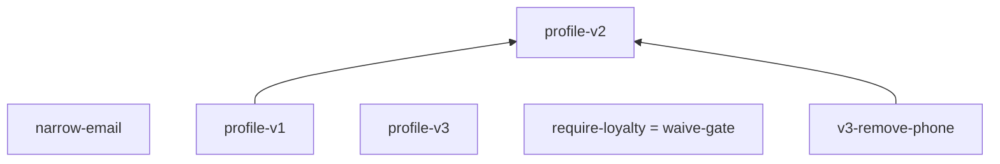

# 04. Schema-evolution governance for a shared customer-profile schema


## Scenario

A customer-profile schema is the ground truth that dozens of services
(and, increasingly, coding agents) read and write. Once it is shared,
validation is the easy part; the hard problem is **evolution**: which
changes are safe to ship, which break a consumer that was correct
yesterday, and who decides. This use case models three released
versions and a queue of proposals, and drives the evolution verbs
(`subsume`, `breaking`, `hash`, the MCP `diff` tool) as the governance
machinery a schema registry needs:

- `profile-v1.aon`: v1.0.0: closed customer record (id, email, name,
  free-form `phone?`, strict `tier` enum, consent flags with safe
  defaults), plus the `aontu_policy.compat` declaration.
- `profile-v2.aon`: v2.0.0: additive minor (optional `locale`,
  optional validated `contact` block) and `phone` marked
  `deprecate(string, {msg, use, since})`.
- `profile-v3.aon`: v3.0.0, a major: `phone` removed, required
  `region` added.
- `proposals/`: the PR queue: a narrowed constraint, an added
  required key, a default flip, the staged deprecated-removal, and an
  adversarial PR that waives its own gate.
- `probes/`: small paired documents, one question each: undecided
  verdicts, the gen profile, hash stability, and a version string
  carried inside the document.
- `data/`: instances a service or agent might emit, valid and not.

## The model tree

Each released version is one document of the same shape, which is what
makes them comparable at all. `profile-v2.aon` is drawn here: the
`profile` record the gate reasons about, beside `aontu_policy`, the
waiver block that says which of its findings a reviewer has accepted.

```
$
├── aontu_policy
│   └── compat *"backward"|"forward"|"full"|...
└── profile
    ├── consent
    │   ├── analytics *false|boolean
    │   └── marketing *false|boolean
    ├── contact
    │   ├── phone re("^[+][0-9]{7,15}$")
    │   └── verified *false|boolean
    ├── email re("^[^@ ]+@[^@ ]+[.][^@ ]+$")
    ├── id re("^C[0-9]{7}$")
    ├── locale re("^[a-z][a-z](?:-[A-Z][A-Z]...
    ├── name string&length(integer&min(1))
    ├── phone string
    └── tier "standard"|"premium"|"enterpr...
```

`aontu view doc --depth 3 profile-v2.aon` draws it, and `check.sh` pins it
with `--out --check`. A key with `(n)` after it is a container the
depth bound stopped at, and `n` is how many keys are not drawn; a
leaf carries its canon, which is the kind of thing it is rather
than its value.

## How the model is designed

- **`close()` everywhere.** A governed record refuses undeclared keys;
  closedness is also what makes *removal* of a key visible to the gate
  (an open map would silently admit stragglers).
- **Constraint atoms** carry the field contracts: `re()` for id,
  email, phone (E.164), locale; `length(min(1))` for name;
  `integer & min(0)` for the proposed loyalty balance. `re()` takes a
  portable pattern subset that excludes a quantifier applied to a
  group containing another quantifier, so the locale pattern is
  written `^[a-z][a-z](?:-[A-Z][A-Z])?$`, with the two-letter repeat
  spelled out.
- **`*false | boolean`** for consent flags: a boolean default is only
  overridable by a boolean, so absent flags default to refused and
  anything that is not a boolean is refused.
- **`tier`** is a literal enum, `"standard" | "premium" |
  "enterprise"`, with no default; v3's required `region` is a regex
  constraint, `string & re("^(us|eu|apac)$")`. An instance that omits
  `tier` vets as `disjunct_no_gen` and one that omits `region` as
  `mapval_required`, both class incomplete, exit 3.
- **`deprecate(x, {msg, use, since})`** on `phone` in v2, pointing at
  its successor `$.profile.contact.phone`. The mark rides the value:
  v2 admits exactly what v1 admits, vet reports the field at severity
  `warning` (exit stays 0), and one version later the same mark is
  what `--allow-deprecated-removal` keys on.
- **`aontu_policy: hide({compat: *backward | ...})`** in every
  version; `hide()` keeps it out of generated output. `breaking` reads
  `$.aontu_policy.compat` from the new document, and `--mode` on the
  command line takes precedence over it (see
  [`aontu breaking`](../../docs/reference-api.md#aontu-breaking)).
- The **version number lives in the filename and the git tag, not in
  the document**: a concrete version string is compared like any other
  value, so a whole-document gate reads a bump as a narrowing. The
  `probes/meta-*.aon` pair shows this below, and `--at` anchors the
  gate beneath it.

A gate finding names the path, both sides' canon, and file:row:col
sites in both documents. Refusing `proposals/narrow-email.aon` against
v2:

```
$ aontu breaking --against profile-v2.aon proposals/narrow-email.aon
verdict: breaking

$.profile.email: compat_narrowed [compat]
  the general residual does not contain the specific residual
  expected: re("^[^@ ]+@example[.]com$")
  actual:   re("^[^@ ]+@[^@ ]+[.][^@ ]+$")
  general: proposals/narrow-email.aon:6:19 (re("^[^@ ]+@example[.]com$"))
  specific: profile-v2.aon:14:19 (re("^[^@ ]+@[^@ ]+[.][^@ ]+$"))
```

Containment is decided between the two `re()` patterns themselves, so
the narrowing is reported at the pattern, with both patterns as the
witness.

Because the policy declaration is read from the new document, a
proposal that pins its own policy to `none` passes the gate.
`proposals/waive-gate.aon` makes the same change as
`require-loyalty.aon` and adds `aontu_policy: hide({compat: "none"})`:

```
$ aontu breaking --against profile-v2.aon proposals/waive-gate.aon
verdict: compatible
$ echo $?
0
```

A CI pipeline passes `--mode backward` on the command line, and the
same proposal is refused with `compat_required_added`, exit 1.

`hide()` keeps a value out of generated output but not out of the
comparison. `probes/meta-v1.aon` and `probes/meta-v2.aon` share one
schema body and differ only in `meta.version`:

```
$ aontu breaking --against probes/meta-v1.aon probes/meta-v2.aon
verdict: breaking

$.meta.version: compat_narrowed [compat]
  a concrete value subsumes only itself
  expected: "2.0.0"
  actual:   "1.0.0"
```

`--at` anchors the gate at the contract, and keeps `--mode`, the policy
declaration and the `--allow-*` flags:

```
$ aontu breaking --against probes/meta-v1.aon --at '$.profile' probes/meta-v2.aon
verdict: compatible
$ echo $?
0
```

`aontu vet` reports every deprecated field the schema declares, whether or not
the instance uses it. When the instance omits `phone`, the site is the
schema's:

```
$ aontu vet --at '$.profile' profile-v2.aon data/customer-ok.json
verdict: valid

$.phone: deprecated [compat]
  deprecated: free-form phone is unvalidated; write E.164 to contact.phone (use $.profile.contact.phone) (since 2.0.0)
  schema: profile-v2.aon:20:11 (string)
```

When the instance uses the field, the site is the data's:
`data: data/customer-legacy-phone.json:5:12 ("555 0193")`. The site
role (`schema` or `data`) is carried in `--format json`, so tooling
can tell the two apart; the exit code is 0 either way.

<a id="the-release-history-drawnand-it-is-not-a-chain"></a>

## The release history, drawn, and it is not a chain



Drawn by `aontu view poset --at '$.profile'` over the seven documents,
from `subsume` alone, and pinned as a golden by `check.sh`. An edge
means the upper document **admits everything** the lower one does.

Three things a reader gets here that seven `subsume` runs do not:

- **v3 is attached to nothing.** It neither generalises nor narrows v1
  or v2: the structural signature of a major break, at a glance rather
  than inferred from a version number.
- **`require-loyalty` and `waive-gate` are one node.** Two
  independently written proposals that subsume each other at this
  anchor, so they make the identical schema change. No diff between
  them would say that: they differ in comments and in one policy value.
- **Seven documents, six nodes.** The collapse is by *mutual
  subsumption*, not by hash: two documents can mean the same thing and
  hash differently, so a diagram keyed on the canon-hash alone would
  draw a two-cycle and call it a partial order.

The picture is **profile-dependent**: at `--profile values` the
`default-change` proposal joins v2's node, because the admitted value
set is unchanged and only the materialised default moves. The profile
and the anchor are therefore printed into the diagram's first line.

## What check.sh proves

`check.sh` drives the CLI end to end and asserts every outcome: exit
codes, error and reason codes grepped from the reports, and JSON
reports diffed against the `expected/` goldens.

1. All three released versions render with `--canon`, and v2's
   canonical form matches `expected/profile-v2.canon`.
2. A conforming v2 instance (`data/customer-ok.json`) is
   `verdict: valid`, exit 0, with the `deprecated` warning for `phone`
   anchored at its schema site (`schema: profile-v2.aon`).
3. A legacy instance still using `phone` is valid, and the
   `--format json` report matches `expected/vet-legacy-phone.json`:
   one `deprecated` finding at severity `warning`, sited at the data
   (`data/customer-legacy-phone.json:5:12`).
4. The same legacy instance against v1 is valid with no deprecation
   warning.
5. A malformed email is `verdict: invalid`, exit 1,
   `[aontu/constraint]`.
6. An undeclared key (`twitter`) is refused by the closed map: exit 1,
   `[aontu/closed]`.
7. An instance that omits the required literal-enum key `tier` is
   `verdict: incomplete`, exit 3, `disjunct_no_gen`.
8. An instance without v3's required `region` is `verdict: incomplete`,
   exit 3, `mapval_required` at `$.profile.region`.
9. `subsume profile-v2.aon profile-v1.aon` answers `verdict: subsumes`,
   exit 0: v2 admits every v1 instance.
10. `subsume profile-v1.aon profile-v2.aon` is refused with
    `compat_narrowed` at `$.profile.contact` and `$.profile.locale`:
    under closed maps, an addition is not forward-compatible.
11. `breaking --against profile-v1.aon profile-v2.aon` is
    `verdict: compatible`, exit 0 (additive plus deprecate).
12. Narrowing the email pattern (`proposals/narrow-email.aon`) is
    refused: exit 1, `compat_narrowed` at `$.profile.email`.
13. Adding a required key (`proposals/require-loyalty.aon`) is refused:
    exit 1, `compat_required_added` at `$.profile.loyalty`.
14. v3 against v2 is `breaking`, exit 1, and the `--format json` report
    matches `expected/breaking-v3-report.json`: `compat_required_added`
    at `$.profile.region` and `compat_narrowed` at `$.profile.phone`,
    each with its `general` and `specific` sites.
15. `--allow-deprecated-removal` does not excuse the required `region`
    key: v3 against v2 still exits 1 with `compat_required_added`.
16. Removing the deprecated `phone` alone
    (`proposals/v3-remove-phone.aon`) fails plain: exit 1,
    `compat_narrowed` at `$.profile.phone`.
17. The same removal passes with `--allow-deprecated-removal`:
    `"verdict": "compatible"`, exit 0, and the `compat_narrowed`
    finding is kept at `"severity": "warning"`.
18. Flipping the marketing-consent default
    (`proposals/default-change.aon`): `--profile values` answers
    `subsumes`, exit 0, because the admitted set is unchanged;
    `--profile defaults` (the gate's default) exits 1 with
    `compat_default_changed` ("the effective default changed:
    previously generable documents materialise differently or become
    incomplete"), matching `expected/subsume-default-change.json`.
19. Hiding a generated field (`probes/hide-score-*.aon`) is invisible
    to `values` and `defaults` (both exit 0) and caught only by
    `--profile gen`: exit 1, `compat_marks_changed`, with the mark diff
    `general {"type":false,"hide":true}, specific
    {"type":false,"hide":false}`.
20. Under `--profile gen`, v2 subsumes itself: `verdict: subsumes`,
    exit 0.
21. A `must()` check added on the new side
    (`probes/must-email-domain.aon`) stops the gate:
    `verdict: undecided`, exit 3, `sub_evaluate_only` ("an
    evaluate-only check (must) makes the admitted set opaque").
22. `--allow-undecided` turns that into an explicit override: exit 0,
    `sub_evaluate_only` still reported.
23. A spread template that reads its own key with `key()`
    (`probes/routing-v2.aon` against `routing-v1.aon`) is `undecided`,
    exit 3, `sub_path_dependent_spread` ("a path-dependent spread
    template cannot be compared structurally").
24. `proposals/waive-gate.aon`, which pins its own policy to `none`,
    passes the gate: `verdict: compatible`, exit 0.
25. With `--mode backward` on the command line the same proposal is
    refused: exit 1, `compat_required_added`.
26. A version string carried inside the document (`probes/meta-v1.aon`
    against `meta-v2.aon`) is reported as `compat_narrowed` at
    `$.meta.version`, exit 1.
27. `breaking --at '$.profile'` on the same pair is
    `verdict: compatible`, exit 0, and `subsume --at '$.profile'`
    answers `subsumes`.
28. `aontu hash profile-v2.aon` and `aontu hash
    probes/v2-reformatted.aon` (keys reordered, comments rewritten,
    whitespace collapsed) print the same pin,
    `aon1-oUzLyquaExn0c2SEql1U-otsj-B0YP22HStsxHvucyU`.
29. v3 hashes differently: a semantic change moves the pin.
30. `hash --form` prints the hashed text with its
    `close`/`hide`/`deprecate` marks; `--canon` prints the value
    without them.
31. `aontu diff profile-v2.aon profile-v3.aon` is a usage refusal, exit
    2 ("a mistyped verb reads as a filename"). The change list comes
    from the MCP server's `diff` tool, called over stdio with JSON-RPC,
    and matches `expected/diff-v2-v3.json`: `removed $.profile.phone`
    with its deprecate canon, `added $.profile.region`. The tool's own
    description scopes it: "Whether a change is BREAKING is the
    breaking verb's question, not this one."
32. The CI form gates a working file against its committed ancestor:
    with v1 committed and v2 in the working tree,
    `aontu breaking --against 'git#HEAD' profile.aon` is `compatible`,
    exit 0; with the narrowed proposal in the working tree it exits 1
    with `compat_narrowed`.
33. The subsumption poset above renders from the seven documents with
    `aontu view poset` and matches `expected/diagram-poset.mmd`.

## Running it

`./check.sh`, from anywhere; set `AONTU=` (and `MCP=` for the server)
to point at another build. `git` must be on the path: the `git#HEAD`
step is part of the case's contract, and a run that cannot exercise it
fails rather than skips. Every step prints a numbered line, and the
script stops at the first failure.

The gate as CI runs it, one line against the committed version of the
same file:

```sh
aontu breaking --against 'git#HEAD' profile.aon
```

The how-to guides [Gate schema changes](../../docs/how-to/gate-schema-changes.md)
and [Pin what a document means](../../docs/how-to/pin-a-document-hash.md)
walk the same gate and the same hash pin in a smaller setting.
