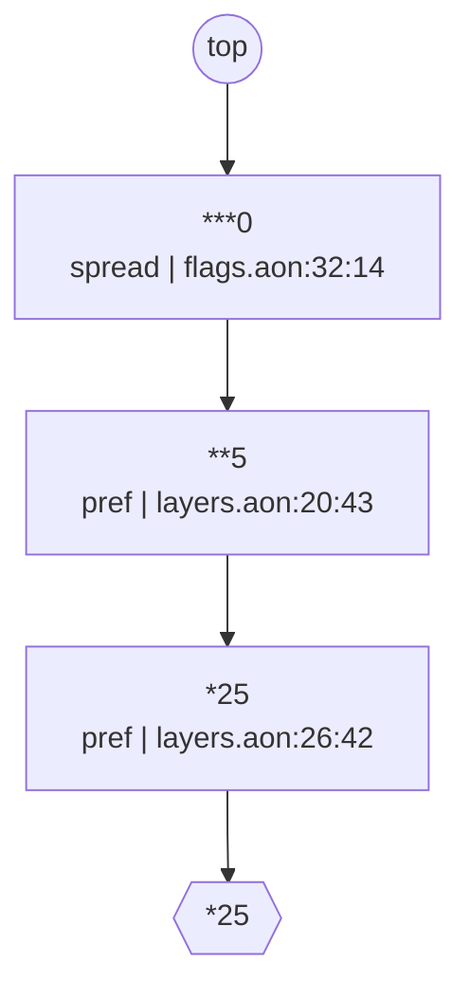

# 08. Feature flags / runtime config (the write-path case)


## Scenario

A feature-flag service is the config system that is written most
often: a catalog of flag definitions (type, default, owner, expiry),
per-environment and per-tenant overrides, and an operational loop in
which an agent or on-call operator changes a flag now, without editing
the code-reviewed base files. The same document that serves the config is
the ground truth that constrains the change. So this case exercises
the write path: `aontu set <path>=<value> --entry base.aon --overlay
overlay.aon`, run repeatedly, plus `why` for provenance and `--trust`
for containing a hostile overlay.

## The model tree

`system.aon` is the base plus the overlay an operator writes.
`flags` is the catalog; `envs` and `tenants` are the override layers,
`effective` the resolved views built from all three, and `policy` the
audits that run over them. `clock` is the one input a flag's expiry is
measured against.

```
$
├── clock
│   └── today "2026-08-26"
├── defs
│   └── Zombie (2)
├── effective
│   ├── prod (3)
│   └── staging (1)
├── envs
│   ├── prod (1)
│   └── staging (1)
├── flags
│   ├── checkout_v2 (8)
│   ├── ops_incident_banner (9)
│   ├── payments_legacy_gateway (8)
│   ├── search_reranker_v3 (8)
│   └── ui_dark_mode (9)
├── policy
│   ├── lifecycle (4)
│   └── rollout_range (6)
└── tenants
    ├── megacorp (1)
    └── starterco (1)
```

`aontu view doc --depth 2 system.aon` draws it, and `check.sh` pins it
with `--out --check`. A key with `(n)` after it is a container the
depth bound stopped at, and `n` is how many keys are not drawn; a
leaf carries its canon, which is the kind of thing it is rather
than its value.

## Files

| File | Role |
|---|---|
| `flags.aon` | org-wide catalog: 6 flags, owner/expiry regexes, ranked `***` lifecycle defaults, one kill-switch pin, one narrow-only `message?` field |
| `layers.aon` | `**` environment and `*` tenant layers (hidden), plus the `effective.<env>.<tenant>` views a flag SDK would read |
| `policy.aon` | `clock.today` (stamped data: the language has no clock), the expired-flag lifecycle audit, the 0..100 rollout audit, both as `filter()` + `must(close({}))` |
| `base.aon` | flags + layers + policy: the `--entry` for `set` (it never includes the overlay) |
| `overlay.aon` | the ops overlay, written only by `aontu set` |
| `system.aon` | base + overlay: the runtime view served to SDKs; `get`, `why` and evaluation run here |
| `flag-schema.aon` | the strict, closed `Flag` definition: a vet-only document that `base.aon` never includes |
| `data/` | agent-proposed flag candidates: one clean, one five-way-bad, one incomplete |
| `attack/` | a hostile overlay pulling `@"/etc/hostname"` into a flag value |
| `expected/` | JSON goldens for the build and all four effective views, the catalog canon, and the meet-ladder diagram |

## How the model is designed

- **Rank ladder for defaults.** Org catalog defaults are `***` (the
  weakest), environments `**`, tenants `*`; a concrete pin beats any
  rank. Fewer stars win when preferences meet, so
  `***0 & **5 & *25 = 25` with no priority table anywhere.
- **Effective views by reference conjunction.**
  `effective.prod.megacorp: $.flags & $.envs.prod.flags &
  $.tenants.megacorp.flags`. A reference unifies a copy in place, so
  every overlay write flows into the served views automatically.
- **Kill switch = concrete pin.** `payments_legacy_gateway.enabled:
  false` is a plain literal, so no overlay (rank or concrete) can
  flip it; `set` refuses.
- **Narrow-only field.** `ops_incident_banner.message?: string &
  length(max(80))` carries a constraint but no value; the first
  concrete value arrives via `set`, which may narrow but never
  contradict.
- **Expiry as data + audit.** Dates are `re()`-checked strings;
  `clock.today` is stamped by CI. The cross-field rule "expired
  flags must be disabled" is `filter($.flags, { expiry:
  below($.clock.today), enabled: true })` feeding
  `must(close({}), ...)`: the violation set must be empty. It lives
  in `policy.aon` rather than in a shared `Flag` definition, because
  a relative reference inside a referenced definition does not rebind
  to the instance. The audit judges concrete enablement, and every
  value `aontu set` writes is a concrete literal.
- **Bare preferences on defaulted fields, types in the schema
  document.** The catalog's defaulted fields carry bare preferences
  (`enabled: ***false`, `rollout: ***0`) rather than a type conjunct.
  Type and range checking is `vet`'s job, against the strict `Flag`
  definition in `flag-schema.aon`, which stays unhidden and outside
  the generated model; the rollout-range audit in `policy.aon` checks
  the catalog, the staging view and the megacorp view.
- **The field shapes are named, in one of the two files.**
  `flag-schema.aon` declares `%Key`, `%Owner`, `%Description` and
  `%Date` as **aliases** (`%name = value` at the top level, `%name` in value
  position) so `created` and `expiry` cannot drift apart. An alias
  does not generate and does not appear in canon, so the named file
  and the written-out one are the same document with the same `aon1-`
  hash. `flags.aon` repeats all four and does not name them, for two
  reasons worth knowing before reaching for an alias: an alias reaches
  nothing outside the document it is declared in (there is no
  construct for carrying a name across a file boundary), and inside a
  `&:` spread template an alias reference is not resolved: it leaks
  into canon as `$.%Date` and changes the hash. Outside a spread,
  the alias resolves to its declared value.
- **Map keys use `_`, not `.`.** Flags are keyed `checkout_v2`, not
  the public `checkout.v2`: CLI paths for `get`, `why` and `set` split
  on `.`, so the dotted public name is ordinary data in `.key`.
- **One overlay line per path.** The overlay holds bare assignments.
  `set --in-place` rewrites the existing literal instead of appending
  a conjunct, so repeated writes to the same path leave one line, and
  `why` attributes the value to the overlay file.

## The arbitration, drawn



The meet ladder for one path, drawn by `aontu view ladder --at
'$.effective.prod.megacorp.checkout_v2.rollout'` from the `why` record
alone and pinned as a golden by `check.sh`. Each rung is one contribution, carrying its
canon, its role and its source position; the descent runs from `top` to
the resolved value.

**Fewer stars win**, so the rungs read weakest-first and the winner is
the last rung before the value: the org catalog's `***0`, then the prod
environment's `**5`, then the megacorp tenant's `*25`, which is the
answer. `aontu why` prints the same three facts as three lines; what
the ladder adds is that the arbitration is a shape.

`why` returns its conjuncts in source order, not rank order, so the
verb sorts them by `rank` (the engine's own number on each
contribution) before drawing.

## What check.sh proves

1. `base.aon` builds and matches `expected/base.json` (6 flags, 3
   envs, 2 tenants), and `--canon flags.aon` matches
   `expected/flags.canon.txt`: the defaults keep their rank and the
   kill switch is a pin.
2. The rank ladder resolves without a priority table. For
   `checkout_v2.rollout`, the org `***0` gives 0 in the catalog; the
   env `**` defaults give 100 in staging and 5 in prod; megacorp's
   tenant `*25` beats the env; starterco's `*0` opts out over the
   env's `**5`. Prod's `**true` enables a flag the org defaults dark,
   `ui_dark_mode.variant` resolves through all three ranks
   (`"midnight"` for megacorp, `"dusk"` in staging), and the kill
   switch pin holds through the prod view.
3. All four effective views (`staging.base`, `prod.base`,
   `prod.megacorp`, `prod.starterco`) match their JSON goldens byte
   for byte.
4. `vet --at '$.Flag' --closed flag-schema.aon` classifies the agent
   candidates. The clean one is `valid` (exit 0). The bad one is
   `invalid` (exit 1) with five `[aontu/constraint]` findings (key
   case, foreign owner domain, short description, slashed date,
   rollout 150) plus `[aontu/closed]` on the undeclared
   `jira_ticket`. The half-written one is `incomplete` (exit 3,
   `[aontu/mapval_spread_required]`): a distinct machine-readable
   state from `invalid`. The code should be `mapval_required` (no
   spread is involved) and says "spread" because `Flag` is written
   one statement per field, so each field reaches the map through a
   meet, which the engine records as it records a spread template's
   key. The example check verifies this diagnostic. `--format sarif` emits
   SARIF 2.1.0 for CI ingestion.
5. A resolved flag read back out of the effective view with `get`
   re-validates against the strict schema. `vet --at` re-roots the
   document at the anchor, so a whole view is validated flag by flag.
6. The first `set` appends one conjunct with `verdict: valid`, and
   the overlay flows into the effective view (25 -> 50). Setting the
   same value again is `valid` and appends a second identical line; a
   differing value is then refused with `[aontu/scalar_value]`
   against the earlier line. `--in-place` rewrites the literal
   instead: ten successive sets of the same path leave one overlay
   line, the last value wins, and each run reports the edit it made:

   ```
   verdict: valid
   replaced: overlay.aon:2:59 90 -> 55
   wrote: overlay.aon
   ```

7. Setting the kill switch on is refused (exit 1) and writes nothing;
   the overlay has no `payments_legacy_gateway` line afterwards:

   ```
   verdict: invalid

   $.effective.prod.base.payments_legacy_gateway.enabled: empty [conflict]
     [aontu/empty]: Cannot unify values at path $.effective.prod.base.payments_legacy_gateway.enabled
   ```

8. Narrowing is distinguished from contradiction. On
   `ops_incident_banner.message`, the 84-character string is refused
   with `[aontu/constraint]` (exit 1) and nothing lands in the
   overlay:

   ```
   $.effective.prod.base.ops_incident_banner.message: constraint [conflict]
     [aontu/constraint]: Cannot unify values at path $.effective.prod.base.ops_incident_banner.message
     data: overlay.aon:3:44 ("this incident message is deliberately way over the eighty character maximum length")
     schema: flags.aon:81:24 (string&length(integer&min(0)&max(80)))
   ```

   The in-range message `"Elevated 5xx on EU checkout; incident
   IN-2214"` is `verdict: valid`: the first concrete value narrows
   the constraint.
9. The catalog maps are open, so the same over-length string aimed at
   `search_reranker_v3`, which declares no `message` field, is
   accepted by `set` (exit 0) and served in the effective view.
   Vetting the resolved flag against the closed `Flag` definition
   refuses it with `[aontu/constraint]` (exit 1): the strict schema
   is the read-side contract for paths the catalog does not declare.
10. The `must()` audits fire on the write path. Enabling the expired
    `search_reranker_v3` is refused (exit 1) with the author's
    message, the overlay is untouched, and `system.aon` still
    evaluates (exit 0):

    ```
    verdict: invalid

    $.policy.lifecycle.catalog: must [conflict]
      [aontu/must]: Cannot unify values at path $.policy.lifecycle.catalog
      note: expired flags must be disabled
    ```

11. The range audit fires the same way. `set ... rollout=200
    --in-place` is refused with `[aontu/must]` and `rollout must be
    an integer in 0..100`, reporting the edit it declined (`would
    replace: overlay.aon:2:59 55 -> 200`) and writing nothing, so the
    runtime view stays valid; an in-range value (55) is accepted.
12. `why` at the tenant path attributes the value to both files, the
    `*25` preference in `layers.aon` and the winning 55 in
    `overlay.aon`:

    ```
    $.tenants.megacorp.flags.checkout_v2.rollout = 55
      1. *25  layers.aon:26:42  (pref)
      2. 55  overlay.aon:2:59
    ```

    At the effective path, `why` names the catalog's `***0` spread in
    `flags.aon` as the first rung.
13. Under `--trust root:<model-dir>` the runtime view evaluates
    normally and the attack overlay's absolute include is refused at
    parse time (exit 1):

    ```
    include denied: /etc/hostname (capability: root:<model-dir>)
    ```

    `--trust none` refuses every include, `./base.aon` included, so
    the evaluation is fully hermetic.
14. The meet ladder above, rendered by `aontu view ladder` at
    `$.effective.prod.megacorp.checkout_v2.rollout`, matches
    `expected/diagram-ladder.mmd`.

## Running it

From this directory, `./check.sh` runs all 43 assertions and exits 0.
It works on a temporary copy of the model, so the committed
`overlay.aon` is never touched.
