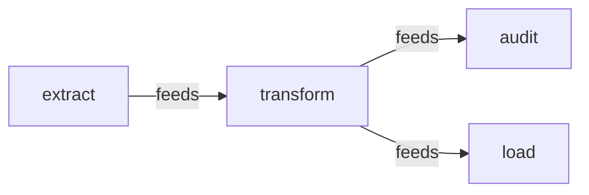
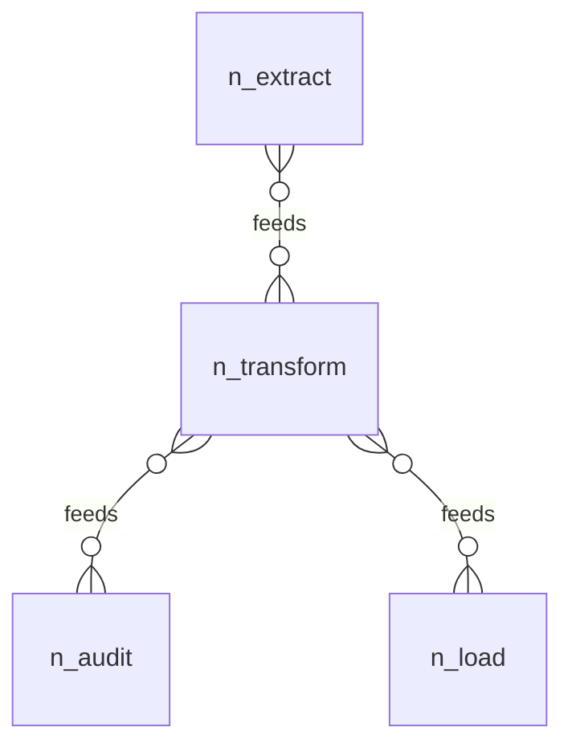

# 12. Relations: a pipeline DAG, declared once, enforced at generation

An ETL pipeline of four jobs (extract, transform, load, audit), each
addressed by its tree path, with one relation between them: `feeds`,
and its written-out inverse `fedBy`. The relation is declared once, at
its field in the schema; the data documents are plain lists of
addresses; and the two graph properties, no cycles and every edge
mirrored, are decided at generation, where every edge is known. The
model holds nothing else, so the relation surface is the only thing in
the frame.

## The pipeline, drawn

Both diagrams below are drawn from this model by
[`aontu view graph`](../../docs/reference-api.md#aontu-view), which
reads the edge set and the relation declarations and nothing else, and
both are pinned as goldens by `check.sh`.



**Six written edges, three logical ones.** `graphOf` reports every
written position, and `feeds` is declared `inverse(fedBy)` with both
directions written out, so the raw edge set doubles every relation that
has an inverse. The verb reads the declaration, draws the DECLARING
direction and suppresses the mirror, and its loss report says so:
`inverse_suppressed  3`.

The same edges as an entity-relationship diagram, `--as er`:



Cardinality is drawn many-to-many throughout because the model does not
state one. Drawing a cardinality the model does not assert would be an
invention.

## The model tree

`model.aon` is the vocabulary plus the topology. `spec` generates
empty (it is `hide()`-marked, being schema rather than data) and
`pipeline` holds the four jobs, each with its `feeds` and `fedBy`
address lists.


```
$
├── %JobEdge rel({"kind":"job"})
├── pipeline
│   └── jobs
│       ├── audit (4)
│       ├── extract (4)
│       ├── load (4)
│       └── transform (4)
└── spec
    ├── Job
    │   ├── cmd string
    │   ├── fedBy rel({"kind":"job"})
    │   ├── feeds rel({"kind":"job"})&acyclic()...
    │   └── kind "job"
    └── JobShape
        └── kind "job"
```

`aontu view doc --depth 3 model.aon` draws it, and `check.sh` pins it
with `--out --check`. A key with `(n)` after it is a container the
depth bound stopped at, and `n` is how many keys are not drawn; a
leaf carries its canon, which is the kind of thing it is rather
than its value.

## The model

`model.aon` is the root: one evaluation that includes the vocabulary
(`spec.aon`) and the topology (`pipeline.aon`). The whole relation is
one line of schema in `spec.aon`, with the inverse field declared
`rel` beside it:

```aon
%JobEdge = rel($.spec.JobShape)

feeds?: %JobEdge & acyclic() & inverse(fedBy)
fedBy?: %JobEdge
```

`%JobEdge` is an **alias**: `%name = value` at the top level declares one and
`%name` in value position uses it. It does not generate and does not
appear in canon, so `spec.aon` with the name and `spec.aon` with
`rel($.spec.JobShape)` written out at both ends are the same document
with the same `aon1-` hash. What it buys is that a relation and its
inverse can no longer be declared over different endpoint types, which
is a mistake nothing else here would catch: `inverse()` checks that
every edge is mirrored, not that the two ends agree about what they
point at.

- `rel(t)`: the field's strings are checked entity addresses, and
  `t` flows into every target. Here `t` is `JobShape`, a thin sibling
  shape (`kind: job`) naming what the far end of every edge must be.
- `acyclic()`, `inverse(fedBy)`: the graph atoms: lattice-inert
  declarations, registered during unification and decided at
  generation, where every edge is known.

The data (`pipeline.aon`) is plain lists of addresses under
`&: $.spec.Job`. Each job lists what it feeds and what feeds it, both
directions written out, because `inverse()` checks the mirror and does
not write it for you. There is no `relations:` block anywhere; that
key is ordinary user data.

`proposals/append.aon` adds a fifth job, `archive`, from a separate
position. Lists unify positionally, so the proposal restates
`transform.feeds` in full with the new address appended.

The constructs are specified in the language reference under
[Declared relations](../../docs/reference-language.md#declared-relations).

## What check.sh proves

1. `model.aon` generates and the output matches `expected/model.json`:
   the atoms hold, and every link is the plain address string the
   author wrote.
2. `aontu relations model.aon` answers `verdict: pass` without
   generating.
3. `--canon` renders the declarations at the field, `acyclic()` and
   `inverse("fedBy")`, so a reparse re-registers them.
4. `bad/cycle.aon` (load feeds extract) refuses at generation with a
   located `[aontu/relation_cycle]`, and `aontu relations` answers
   `verdict: fail`, naming the loop:
   `cycle $.pipeline.jobs.extract -> $.pipeline.jobs.transform -> $.pipeline.jobs.load -> $.pipeline.jobs.extract`.
5. `bad/missing-inverse.aon` (a new `metrics` job fed by `transform`
   whose `fedBy` is empty) refuses with
   `[aontu/relation_inverse_missing]`, and the verb names the exact
   entry:
   `$.pipeline.jobs.metrics does not list $.pipeline.jobs.transform under fedBy`.
6. `bad/wrong-kind.aon` (an edge landing on a dataset) is `rel(t)`'s
   flow refusing at evaluation: an ordinary located
   `[aontu/scalar_value]` conflict at the target's `kind`, and
   `aontu relations` answers `verdict: error` with exit code 4.
7. `bad/dangling.aon` (an address naming no node) refuses inside the
   evaluation with `[aontu/rel_unresolved]`: existence is decided,
   never deferred.
8. `proposals/append.aon` generates, matching `expected/append.json`,
   and `aontu relations` still answers `verdict: pass`: the appended
   element converts like the originals, and its inverse is checked.
9. `aontu reaches --relation feeds` answers directionally over the same
   edges: extract reaches load (`verdict: reaches`, with the path
   `$.pipeline.jobs.extract -> $.pipeline.jobs.transform -> $.pipeline.jobs.load`),
   and load does not reach extract (`verdict: unreachable`, exit
   code 1).
10. Both diagrams above render byte-for-byte to
    `expected/diagram-graph.mmd` and `expected/diagram-er.mmd`, the
    graph carries exactly three edges after the inverse collapse, and
    `aontu view matrix` over the two bad documents shows the defects as
    glyphs: the missing inverse is `!`, and the cycle is the one cell
    above the diagonal that no ordering removes (`cycle_block`).

## Running it

From this directory, `./check.sh` runs all 10 assertions and exits 0.
It drives the TypeScript CLI (`ts/bin/aontu.js`, or the command in
`$AONTU`) and runs from any cwd.
