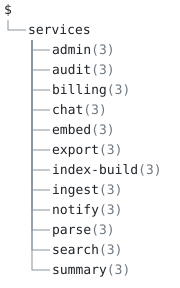

# 17. Lambda handlers from a service model



## Scenario

A backend of twelve services on one message wire, each deployed as its
own Lambda handler. Every handler is the same forty lines with three
things that vary per service: the patterns it listens on, the patterns
it calls out to, and whether it picks up files from S3. The handlers
are generated, and the generator is **the handler file itself**, in
the canonical form a template file expands into: one rule set
whose body is the file, line for line, with three nested dispatches
where the file varies.

Nothing in the mechanism is about handlers. `emit`, `match`, `replace`,
`body`, `esc` and `form` are the whole vocabulary; what makes this
produce Lambda handlers is the target text in the body.

## The model tree

`model.aon` is one map of services; each has its `listen` and `client`
pins and its `on.file.events`, empty where it has nothing to say,
because the generator reads all three and a dispatch over an empty
selection emits nothing.

```
$
└── services
    ├── admin (3)
    ├── audit (3)
    ├── billing (3)
    ├── chat (3)
    ├── embed (3)
    ├── export (3)
    ├── index-build (3)
    ├── ingest (3)
    ├── notify (3)
    ├── parse (3)
    ├── search (3)
    └── summary (3)
```

`aontu view doc --depth 2 model.aon` draws it, and `check.sh` pins it
with `--out --check`.

## The generator

`gen.aon` includes the model, gives each service its name
(`svc: $.services & pack($.services, { name:key() })`), and declares
the rule set:

```aon
%handler = emit(_, {
  match: name: string
  esc: sq
  replace: SERVICE: .name
  body: [
    "import { getSeneca } from '../../env/lambda/lambda'"
    ""
    "function complete(seneca: any) {"
    emit(.listen, {
      match: pin: string
      esc: sq
      replace: PIN: .pin
      body: ["  seneca.listen({type:'sqs',pin:'PIN'})"]
    })
    # ... the client pins, and the S3 hook over filter(.on.file.events, { source: s3 })
    "}"
    ""
    "exports.handler = async ("
    "  event:any,"
    "  context:any"
    ") => {"
    "  "
    "  let seneca = await getSeneca('SERVICE', complete)"
    # ...
  ]
})
```

Four things to read off it:

- **A value reaches a line through `replace`, not a hole.** `SERVICE`
  and `PIN` are ordinary TypeScript in the body; the map says which
  exact strings stand for a value, and the value is evaluated against
  the matched node. There is no delimiter to collide with the target's
  own syntax, which is why a deployment template's `${self:…}` or a
  backtick string survives.
- **Escaping is on.** `esc: sq` names the single-quoted convention
  every value is escaped by. The chat service listens on
  `sys:chat,user:o'brien`, and the handler carries
  `pin:'sys:chat,user:o\'brien'`, the line the compiler would
  otherwise reject.
- **A line is verbatim.** The two lines that are two spaces and
  nothing else, and the two blank lines, are in every handler because
  they are in the body. There are no trim markers, because nothing
  leaks: a rule is not an output line.
- **The conditional is the selection.** A service with no S3 events
  gets no gateway hook, because `filter(.on.file.events, { source:
  s3 })` selects nothing and a dispatch over nothing emits nothing.

The unit list is one dispatch over two parts, the service map and an
index marker: each service becomes a unit at `handlers/<name>.ts`, and
`index.ts` names every service in the model's order with a constant
spelled by the name-derivation chain, `join(form(split(_, "-"),
upper(_)), "_")`, so `index-build` is `INDEX_BUILD`. `form` keeps the
order where a `pack` would sort, and `aontu render --check expected`
holds all thirteen files.

## What check.sh proves

1. `aontu render --check expected gen.aon` is green: twelve handlers
   under `expected/handlers/` and `expected/index.ts` match their
   goldens byte for byte.
2. All thirteen files parse as TypeScript, by the compiler's own
   parser with no diagnostics.
3. `expected/handlers/chat.ts` carries `pin:'sys:chat,user:o\'brien'`:
   `esc: sq` escaped the apostrophe for the literal it lands in.
4. `expected/handlers/notify.ts` has exactly two lines of two spaces
   and two blank lines: whitespace is verbatim.
5. `ingest.ts` has the S3 gateway hook for `sys:ingest,cmd:file`,
   `notify.ts` has none, and `index-build.ts` hooks its S3 event and
   not its SQS event.
6. `expected/index.ts` is twelve lines in the model's order, starting
   with `admin`, and carries `export const INDEX_BUILD = 'index-build'`.
7. `bad/overlap.aon` (the key `P` inside `PIN`) is refused with
   `[aontu/replace_overlap]`, and `bad/unused.aon` (a key the body
   does not hold) with `[aontu/replace_unused]`, both before any node
   is visited.
8. `--check` against a copy of the goldens with one handler edited by
   hand is red, exit 1, naming `handlers/chat.ts`.
9. The Go port renders the same thirteen units byte for byte and
   refuses the same seeded template (skipped with a note when no Go
   toolchain is present).
10. The model tree draws and is pinned, text and SVG.

## Running it

From this directory, `./check.sh` runs all 10 assertions and exits 0.
It drives the TypeScript CLI (`ts/bin/aontu.js`, or the command in
`$AONTU`) and, when `go` is on the path, the Go CLI built from `go/`.
The verb by hand:

```sh
aontu render --stdout --unit handlers/chat.ts gen.aon   # one handler
aontu render --check expected gen.aon                    # hold them all
```
