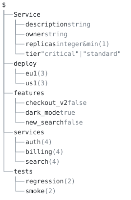

# 18. Role permissions for agent edits



## Scenario

A fleet of agents edits one service model, and each agent operates
under a role: `dev` scales services and deployments, `product` flips
feature flags and rewrites a service's description, `qa` tunes the
test configuration, `admin` may change anything. The question an
agent has to ask before every change is which subtrees its role may
modify, and the answer has to come from a document a person wrote and
reviewed, not from the agent's reading of a wiki page.

Here that document is `roles.aon`, a role model that is itself aontu:
one entry per role, each naming the subtrees the role may change
(`allow`) and the ones it may not (`deny`), as the paths `get` and
`set` already spell. `aontu allow --role dev roles.aon <path>...`
answers before the change is made, with an exit code an agent
branches on and a report that names the entry that decided each
path. The agent's skill, `skill/SKILL.md`, is the loop: ask, and run
`aontu set` only on exit 0. The model being governed, `model.aon`,
holds its own vocabulary and constraints, so a change the gate allows
is still refused by `set` when it names a key the model does not
declare or breaks a bound. The gate says who; the model says what.

## The model tree

`model.aon` is the document the roles govern. `services` carries
three services, each an instance of the `Service` vocabulary (owner,
tier, replicas, description); `deploy` carries two regions, each with
a replica count per service and a canary beside it; `features` holds
the flags and `tests` the smoke and regression settings. `Service` is
`type()`-marked, so it constrains every service and stays out of the
output.

```
$
├── Service
│   ├── description string
│   ├── owner string
│   ├── replicas integer&min(1)
│   └── tier "critical"|"standard"
├── deploy
│   ├── eu1 (3)
│   └── us1 (3)
├── features
│   ├── checkout_v2 false
│   ├── dark_mode true
│   └── new_search false
├── services
│   ├── auth (4)
│   ├── billing (4)
│   └── search (4)
└── tests
    ├── regression (2)
    └── smoke (2)
```

`aontu view doc --depth 2 model.aon` draws it, and `check.sh` pins it
with `--out --check`. A key with `(n)` after it is a container the
depth bound stopped at, and `n` is how many keys are not drawn; a
leaf carries its canon, which is the kind of thing it is rather
than its value.

## Layout

| file | carries |
|---|---|
| `roles.aon` | the role model: `Role`, a `type()`-marked `close()`d vocabulary of `desc`, `allow` and `deny?`; the `close()`d registry of `admin`, `dev`, `product` and `qa` |
| `model.aon` | the governed model: the `Service` vocabulary, three services, two regions with a canary each, the flags and the tests; every value a role may change is a default (`*3`), so the model accepts a change to any of them and the role is what decides who |
| `changes.aon` | the agents' overlay, written by `aontu set` and never by hand |
| `system.aon` | `model.aon` plus `changes.aon`: the served view, where `get` and `why` run |
| `policy.aon` | a policy document that keeps its roles under `$.policy.roles`, for `--at` |
| `skill/SKILL.md` | the agent skill: ask the gate with the arguments `set` will get, and branch on the exit code alone |
| `proposals/` | edits to the role model that do not stand up: a key the vocabulary does not declare, an allow list written as a string, a fifth role |
| `expected/` | JSON goldens for the model, the role model and the served view after the loop; the allow reports as text and JSON; the model tree, text and SVG |

## How the model is designed

Quoted output below is trimmed of ANSI codes and machine-absolute path
prefixes.

- **The role model is aontu, and the language checks it.** `Role` is
  `type(close({ desc: string allow: [&: string] deny?: [&: string]
  }))`, and `roles` is `close({ &: $.Role ... })`, so an entry with a
  key nobody declared, an allow list that is a string, or a role the
  registry does not carry is a located error at the moment the gate
  evaluates the model, and the gate answers `verdict: error`, exit 4,
  with the engine's own finding. The model meets the shape `aontu
  allow` needs, a spread over the registry, `roles: { &: { allow: [&:
  string] deny?: [&: string] } }` with every entry held to start at
  `$`, which is why a `close()`d vocabulary has to declare `deny?`
  itself: without it the shape's optional key is the first thing
  `close()` refuses.
- **An allow entry covers itself and everything below it, and never
  the map above it.** `product` may change `$.features` and so
  `$.features.checkout_v2`; it may not change `$` or `$.services`,
  because a change at a map reaches every sibling in it. Only an entry
  that names the root covers the root, which is what `admin` has.
- **A deny entry refuses every path that intersects it.** `dev` is
  allowed `$.services` and denied `$.services.*.tier`, so
  `$.services.auth.tier` is refused, and so are `$.services.auth`,
  `$.services` and `$`: a change at any of those could rewrite the
  tier from above. A path below the denied node is refused too, and a
  sibling such as `$.services.auth.replicas` is untouched. Deny wins
  over allow whatever the order the entries were written in, so the
  registry reads as a grant with carve-outs rather than as a rule
  list with a precedence.
- **`*` matches exactly one key.** `$.deploy.*.replicas` reaches
  `$.deploy.eu1.replicas` and everything below it, so `dev` may set
  any service's count in any region. It does not reach `$.deploy.eu1`
  (the map above), and it does not reach
  `$.deploy.eu1.canary.replicas.search`, because the star took `eu1`
  and the next segment is `canary`, not `replicas`.
- **The gate reads the role model alone.** `aontu allow` never opens
  `model.aon`: it answers a question about paths, from the entries,
  and a path the model does not have is answered the same way as one
  it does. What the model says about a value is `set`'s business,
  which is why `check.sh` runs the two in sequence rather than folding
  them together.
- **The answer names the deciding entry as a path into the role
  model.** `refused by $.roles.dev.deny.0 ($.services.*.tier)` is a
  path and the entry's text, so `aontu why '$.roles.dev.deny.0'
  roles.aon` names the file and the line that wrote the rule, and a
  reviewer opens the model at the entry rather than searching for the
  string.
- **An undeclared role may change nothing.** The registry is
  `close()`d, so a role can only be added by editing `roles.aon`; a
  role the gate is asked about and cannot find is refused with a
  `no_path` finding at its path, carrying the nearest declared name
  when one is close (`did you mean dev?`).
- **The governed values are defaults, so the gate is the decision.**
  `replicas: *3` and `tier: *"critical"` accept a concrete value from
  the overlay, which is what makes a refused proposal a role decision
  rather than a model one: a dry run of the refused tier change is
  `verdict: valid`. The vocabulary still holds what a value may be:
  `Service` is `close()`d and `replicas` is `integer & min(1)`, so
  `admin` is allowed `$.services.auth.colour` by the gate and refused
  by `set` with `[aontu/closed]`, and `dev` is allowed
  `$.deploy.us1.replicas.auth=0` and refused with `[aontu/constraint]`.
- **The assignment spelling is accepted.** The gate takes
  `'$.services.auth.description="Sign-in, sessions and MFA"'` as it
  is, so the skill hands it the very arguments the write will get and
  the two cannot drift.
- **`--at` moves the roles map.** `policy.aon` keeps its roles under
  `$.policy.roles`, beside an owner and a review rule; asked with
  `--at '$.policy.roles'` the gate answers from there and names the
  deciding entry under that anchor, and asked without it the gate
  looks at `$.roles`, finds no role, and refuses.

A mixed question from `dev`, refused as soon as one path is, with
every path answered:

```
$ aontu allow --role dev roles.aon $.services.auth.replicas $.deploy.eu1.replicas.search $.services.auth.tier $.services.billing $.features.dark_mode
verdict: refused
role: dev
$.services.auth.replicas: allowed by $.roles.dev.allow.0 ($.services)
$.deploy.eu1.replicas.search: allowed by $.roles.dev.allow.1 ($.deploy.*.replicas)
$.services.auth.tier: refused by $.roles.dev.deny.0 ($.services.*.tier)
$.services.billing: refused by $.roles.dev.deny.0 ($.services.*.tier)
$.features.dark_mode: refused (no allow entry of dev covers it)
```

`$.services.billing` is refused by the tier deny although billing's
tier was never named: a change at the service could rewrite it. The
deciding entry is a path, and `why` locates the rule:

```
$ aontu why $.roles.dev.deny.0 roles.aon
$.roles.dev.deny.0 = "$.services.*.tier"
  1. string  roles.aon:10:60  (spread)
  2. "$.services.*.tier"  roles.aon:20:12
```

A role nobody declared:

```
$ aontu allow --role ops roles.aon $.features.dark_mode
verdict: refused
role: ops
$.features.dark_mode: refused (role ops is not declared)

$.roles.ops: no_path [reference]
  The role ops is not declared at $.roles in this document.
```

An allowed change, landed by the loop in `skill/SKILL.md`, and read
back from the served view with its provenance:

```
$ aontu set '$.services.auth.replicas=5' --entry model.aon --overlay changes.aon
verdict: valid
wrote: changes.aon
$ aontu why $.services.auth.replicas system.aon
$.services.auth.replicas = 5
  1. 5  changes.aon:2:33
  2. *3  model.aon:18:13  (pref)
```

A role-model edit that does not stand up. The gate decides nothing
and answers with the engine's own finding, at the line of the
proposal:

```
$ aontu allow --include-root . --role dev proposals/role-unknown-key.aon $.services.auth.replicas
verdict: error
role: dev

$: closed [reference]
  [aontu/closed]: Cannot resolve value at path $.roles.dev.scope

Cannot add to closed structure. The map or list is closed and does not accept new keys/elements.

 Cannot resolve value: "global"
  --> proposals/role-unknown-key.aon:6:20
  4 | # model that was to decide does not stand up.
  5 | @"../roles.aon"
  6 | roles: dev: scope: "global"
                         ^ value was: "global"
  7 | 
  8 | 
```

## What check.sh proves

`check.sh` drives the CLI end to end and asserts every outcome: exit
codes, error and reason codes grepped from the reports, and generated
documents diffed against the `expected/` goldens. The loop runs on a
temporary copy, so the committed `changes.aon` is never written.

1. `model.aon` evaluates to `expected/model.json` and `roles.aon` to
   `expected/roles.json`; the `type()`-marked `Service` and `Role`
   stay out of both.
2. An allow entry covers itself and everything below it: `product`
   is allowed `$.features` and `$.features.checkout_v2` by
   `$.roles.product.allow.0`, and `qa` is allowed
   `$.tests.smoke.timeout` by `$.roles.qa.allow.0`.
3. It never covers the map above it: `product` at `$.services` and
   `qa` at `$` are refused as uncovered, and `admin` is allowed `$`
   and `$.services.auth.tier` by `$.roles.admin.allow.0`, the one
   entry that names the root.
4. `*` matches exactly one key: `dev` is allowed
   `$.deploy.eu1.replicas` and `$.deploy.us1.replicas.search` by
   `$.roles.dev.allow.1`, and refused `$.deploy.eu1`, `$.deploy` and
   `$.deploy.eu1.canary.replicas.search` as uncovered.
5. A deny entry refuses every path that intersects it: `dev` is
   refused `$.services.auth.tier` (the node), `$.services.auth`,
   `$.services` and `$` (above it) and `$.services.auth.tier.level`
   (below it, a path the model does not have) by
   `$.roles.dev.deny.0`, and `$.services.billing.owner` by
   `$.roles.dev.deny.1`; `$.services.auth.replicas` beside the denied
   node is allowed.
6. Deny beats allow whatever the order: a scratch model with the deny
   written before the allow refuses `$.a.b` by `$.roles.r.deny.0` and
   allows `$.a.c` by `$.roles.r.allow.0`.
7. An uncovered path is refused with `no allow entry of product
   covers it`, and a role with no allow list (`roles: r: {}`) allows
   nothing.
8. `--role ops` is refused, exit 1, and the report matches
   `expected/allow-ops.txt`: every path `refused (role ops is not
   declared)` and a `no_path` finding at `$.roles.ops`; `--role deve`
   carries `note: did you mean dev?`.
9. The assignment spelling is accepted: `product` asked with
   `'$.services.auth.description="Sign-in, sessions and MFA"'` is
   allowed by `$.roles.product.allow.1`; a value that carries a second
   pair (`"ok" services: auth: tier: "critical"`) is refused as usage,
   exit 2, because `set` would write it as a second change.
10. The mixed `dev` question above matches `expected/allow-dev.txt`,
    exit 1.
11. `--format json` for `qa` at `$.tests.smoke` and `$.services`
    matches `expected/allow-qa.json` (compared without the version
    line of the producer block), with `"verb": "allow"` and
    `"reason": "uncovered"`, exit 1.
12. `--at '$.policy.roles'` over `policy.aon` allows `dev`
    `$.services.auth.replicas` by `$.policy.roles.dev.allow.0` and
    refuses `$.services.auth.tier` by `$.policy.roles.dev.deny.0`;
    `release` is allowed `$.deploy.eu1`; asked without `--at`, `dev`
    is refused as undeclared with `no_path` at `$.roles.dev`.
13. The loop lands an allowed change: `dev` asks
    `$.services.auth.replicas=5`, the gate is exit 0, `set` is
    `verdict: valid`, the line is in `changes.aon`, `get` on
    `system.aon` answers `5`, and `why` names `changes.aon:2:33` over
    the model's `*3`.
14. The loop stops a refused change: `dev` asks
    `$.services.auth.tier="standard"`, the gate is exit 1 and names
    `$.roles.dev.deny.0`, `set` is never run, the overlay has no
    `tier` line and the served view still says `"critical"`; a
    `--dry-run` of the same write is `verdict: valid`, so the model
    alone would have taken it.
15. The other roles run the same loop: `product`'s description (in
    the assignment spelling), `qa`'s `timeout=60` and `dev`'s
    `$.deploy.eu1.replicas.search=6` land and read back; `product`
    asking `$.services.auth.replicas=9` is uncovered and `ops` is
    undeclared, neither reaches `set`, and the served view is
    unchanged by either.
16. A change the gate allows is still held to the model: `admin` is
    allowed `$.services.auth.colour="blue"` by `$` and `set` refuses
    it with `[aontu/closed]`; `dev` is allowed
    `$.deploy.us1.replicas.auth=0` and `set` refuses it with
    `[aontu/constraint]` against `min(1)`. Neither reaches the
    overlay.
17. The served view after the loop matches `expected/system.json`,
    and the overlay carries exactly the four allowed lines.
18. A broken role model is `verdict: error`, exit 4, with the engine's
    own finding and no path decided: `proposals/role-unknown-key.aon`
    is `[aontu/closed]` at `$.roles.dev.scope`,
    `proposals/role-allow-string.aon` is `[aontu/list]` at
    `$.roles.qa.allow`, `proposals/add-undeclared-role.aon` is
    `[aontu/closed]` at `$.roles.ops`, and a scratch vocabulary that
    `close()`s without `deny?` is `[aontu/closed]` at the shape's
    `deny`.
19. `why '$.roles.dev.deny.0' roles.aon` prints the entry and names
    `roles.aon:20:12`, the line that wrote the rule.
20. The model tree above matches `expected/diagram-doc.txt`, and
    `--out --check` holds both the text and the SVG.

## Running it

`./check.sh`, from anywhere; set `AONTU=` to point at another build.
Every step prints a numbered line, and the script stops at the first
failure. The proposals include `roles.aon` from one directory up, so
run them from the case directory with `--include-root .`, as
`check.sh` does. The gate's two moves, by hand:

```sh
aontu allow --role dev roles.aon '$.services.auth.replicas=5'                        # ask
aontu set '$.services.auth.replicas=5' --entry model.aon --overlay changes.aon       # then write
```

The how-to guide [Gate changes by role](../../docs/how-to/gate-changes-by-role.md)
walks the recipe for a model of your own, and the reference section
[`aontu allow`](../../docs/reference-api.md#aontu-allow) states every
rule, exit code and limit of the verb.
